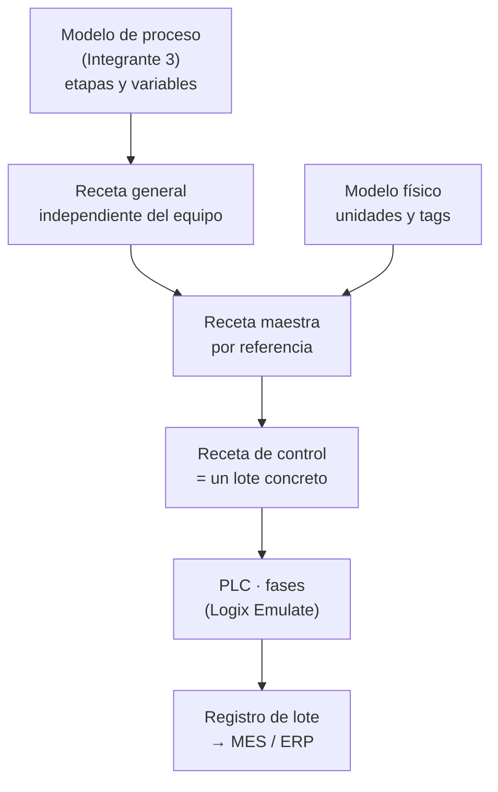

# ISA-88 · Producción por lotes

**Responsable:** Integrante 1 (Luis Alberto Mendoza)
**Base de datos del proceso:** investigación del Integrante 3 ([`08_investigacion`](../../08_investigacion)).
**Línea detallada:** Yogur (referencia principal: **yogur batido de fresa**). Quesos y kéfir son líneas secundarias.

| Documento | Pregunta que responde |
|---|---|
| [`modelo-fisico/modelo-fisico.md`](modelo-fisico/modelo-fisico.md) | ¿Con qué produzco? Áreas, celdas, unidades, módulos de equipo y de control |
| [`modelo-procedimental/modelo-procedimental.md`](modelo-procedimental/modelo-procedimental.md) | ¿Qué acciones ejecuto? Procedimientos, operaciones y biblioteca de fases |
| [`recetas/recetas.md`](recetas/recetas.md) | ¿Qué producto y con qué especificaciones? 9 referencias, lotes y trazabilidad |

## Cómo encajan las piezas

## Supuestos pendientes de validar (Integrante 3)

Todo valor marcado con **(S)** en los documentos es un supuesto de dimensionamiento, coherente con la investigación pero no tomado de ella.

| Supuesto | Valor usado | Base |
|---|---|---|
| Leche recibida | 100.000 L/día | Sabanalac recibe ~350.000 L/día; planta de tamaño medio |
| Reparto por línea | Yogur 45.000 · Queso 40.000 · Kéfir 10.000 · Margen 5.000 L/día | Yogur como línea principal |
| Tamaño de lote yogur | 5.000 L de base (≈ 5.200 kg) | Fermentadores de 5.000 L |
| Tamaño de lote yogur firme (Y3) | 2.500 L | Limitar el llenado en caliente a < 60 min |
| Tamaño de lote queso | 5.000 L de leche por tina | Investigación: tinas de 2.000–5.000 L |
| Rendimiento queso fresco | 7,5 L de leche por kg | Investigación: 7–8 L por queso |
| Tamaño de lote kéfir | 5.000 L | Fermentación de 18–24 h |
| Llenadora de vasos 150 g | 12.000 vasos/h | Llenadora rotativa/lineal de 4 carriles |
| Llenadora botellas/tarros 1 kg | 3.000 unidades/h | — |
| Unidad de homogeneización y tratamiento térmico de bases | 5.000 L/h, **compartida** yogur + kéfir | Recurso compartido: posible cuello de botella |
