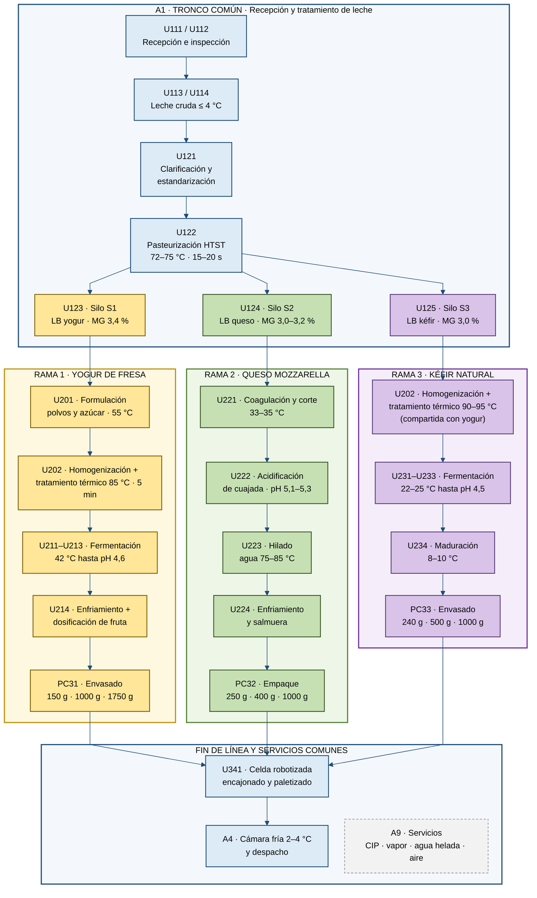

# Planta de derivados lácteos – Tronco común y ramas de producto (ISA-88)

**MEVKRA** · Proyecto Integrador APM 2026-2S

La planta arranca con un tronco común que produce lotes de leche base (LB), uno por silo. Luego se ramifica en tres líneas batch. Cada rama consume un lote LB de su silo, lo que encadena la trazabilidad desde la cisterna hasta el producto terminado.

| Color | Significado |
|---|---|
| Azul | Tronco común y fin de línea (recursos compartidos por las tres ramas) |
| Amarillo | Rama 1 · Yogur de fresa |
| Verde | Rama 2 · Queso mozzarella |
| Morado | Rama 3 · Kéfir natural |
| Gris punteado | Servicios auxiliares |

La unidad U202 aparece en las ramas de yogur y kéfir porque es un recurso compartido: se usa para un lote a la vez y cambia su receta (85 °C para yogur, 90–95 °C para kéfir).

Códigos ISA-88: A = área, PC = celda de proceso, U = unidad, LB = lote de leche base.
