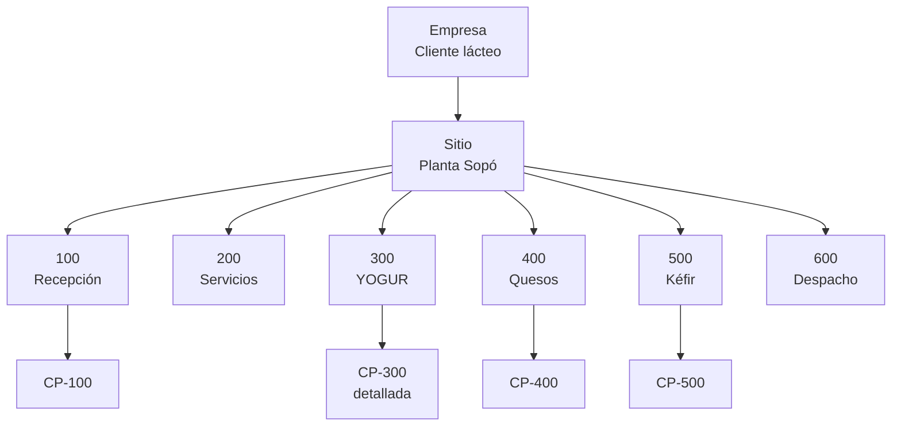
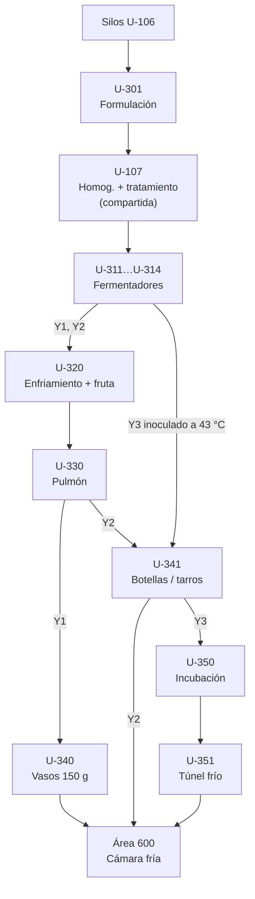

# Modelo físico ISA-88

El modelo físico responde **¿con qué produzco?** Organiza el equipo de la planta en siete niveles. Los tres superiores (empresa, sitio, área) son de gestión; los cuatro inferiores (celda, unidad, módulo de equipo, módulo de control) son los que maneja el control por lotes.

| Nivel ISA-88 | En nuestra planta |
|---|---|
| Empresa | Cliente del sector lácteo (referencia: Alpina) |
| Sitio | Planta de derivados lácteos, Sopó (Cundinamarca) |
| Área | 100 Recepción y preparación · 200 Servicios · 300 Yogur · 400 Quesos · 500 Kéfir · 600 Almacenamiento y despacho |
| Celda de proceso | Conjunto de unidades que forman un tren de producción (p. ej. CP-300 Yogur) |
| Unidad | Equipo donde ocurre una actividad de proceso sobre el lote (p. ej. un fermentador) |
| Módulo de equipo (EM) | Grupo funcional dentro de la unidad (p. ej. control térmico de chaqueta) |
| Módulo de control (CM) | Sensor, actuador o lazo individual (p. ej. TT-311, XV-311A) |

**Convención de nombres.** Unidades `U-AXX` (A = área). Módulos de equipo `EM-AXX-n`. Módulos de control según ISA-5.1: `TT` temperatura, `PT` presión, `LT` nivel, `FT` caudal, `AT` analítico (pH, densidad), `WT` peso, `XV` válvula on/off, `TCV` válvula de control de temperatura, `FDV` válvula de desvío de flujo, `M` motor, `SC` variador, `VS` visión. La columna E/S indica el tipo de señal hacia el PLC (AI, AO, DI, DO) o red (EIP = EtherNet/IP).

Los valores marcados **(S)** son supuestos de dimensionamiento (ver [`../README.md`](../README.md)).

## Vista general

## Área 100 · Recepción y preparación (compartida por las tres líneas)

| Unidad | Clase | Cant. | Capacidad | Función |
|---|---|---|---|---|
| U-101 | Bahía de recepción | 2 | 5.000–30.000 L por cisterna | Registro, muestreo, descarga con medición másica y filtro de línea |
| U-102A/B | Silo de leche cruda | 2 | 50.000 L (S) | Almacenamiento a ≤ 4 °C |
| U-103 | Enfriador de placas | 1 | 20.000 L/h (S) | Enfriamiento de recepción a 2–4 °C con agua helada a 0–2 °C |
| U-104 | Centrífuga clarificadora-estandarizadora | 1 | 15.000 L/h (S) | Clarificación y estandarización de grasa (4.000–6.500 rpm, 45–55 °C) |
| U-105 | Pasteurizador HTST de leche | 1 | 15.000 L/h (S) | 72–75 °C por 15–20 s, con FDV y regeneración de 85–95 % |
| U-106A/B/C | Silo de leche pasteurizada | 3 | 30.000 L (S) | 2–4 °C, agitación 20–30 rpm, residencia máx. 24–48 h |
| **U-107** | **Homogeneización y tratamiento térmico de bases** | 1 | 5.000 L/h (S) | **Compartida yogur + kéfir.** Homogeneización a 150–250 bar y tratamiento a 85–95 °C |

**Módulos de control críticos del área 100** (inocuidad y trazabilidad):

| CM | Descripción | E/S |
|---|---|---|
| FT-101 | Caudalímetro másico de descarga (volumen/peso recibido) | EIP |
| TT-101 | Temperatura de la leche recibida | AI |
| TT-103 | Temperatura de salida del enfriador | AI |
| AT-104 | Densidad en línea (Coriolis) para estandarizar grasa | EIP |
| TT-105A | Temperatura de salida del tubo de retención (registro obligatorio) | AI |
| FDV-105 | Válvula de desvío: adelante si T ≥ 72 °C, recircula si T < 72 °C | DO + 2 DI |
| PDT-105 | Presión diferencial (lado pasteurizado > lado crudo) | AI |
| LT-106A/B/C | Nivel de silos | AI ×3 |

### Detalle U-107 · Homogeneización y tratamiento térmico de bases

| EM | CM | Descripción | E/S |
|---|---|---|---|
| EM-107-1 Tanque de balance | LT-107, XV-107A | Nivel e ingreso de base | AI, DO |
| EM-107-2 Impulsión | P-107, SC-107, FT-107 | Bomba de desplazamiento positivo con variador (caudal constante = tiempo de retención garantizado) | EIP, AI |
| EM-107-3 Homogeneizador | M-107, PT-107A, PT-107B, PCV-107A, PCV-107B | Etapa 1 (150–200 bar) y etapa 2 (30–50 bar) | DO, AI ×2, AO ×2 |
| EM-107-4 Calentamiento | TT-107A, TT-107B, TCV-107A | Regeneración y calentamiento con agua caliente/vapor | AI ×2, AO |
| EM-107-5 Retención y desvío | TT-107C, FDV-107 | Tubo de retención; desvío si T < consigna | AI, DO + 2 DI |
| EM-107-6 Enfriamiento | TT-107D, TCV-107B | Enfriamiento a temperatura de inoculación (22–45 °C según receta) | AI, AO |
| EM-107-7 Seguridad sanitaria | PDT-107 | Presión diferencial lado tratado > lado no tratado | AI |

## Área 200 · Servicios industriales (recursos comunes)

En ISA-88 no son unidades de lote sino **recursos comunes**. Los de *uso exclusivo* se asignan a una sola unidad a la vez y deben programarse; los de *uso compartido* los usan varias unidades al mismo tiempo.

| Recurso | Tipo | Usuarios | Observación |
|---|---|---|---|
| U-201 Estación CIP (2 circuitos) | Uso exclusivo por circuito | Todas las unidades de proceso | El CIP entre lotes es tiempo de *setup*; entra en VSM y OEE |
| Generación de vapor / agua caliente | Uso compartido | U-105, U-107, U-301, tinas de queso | — |
| Agua helada y glicol | Uso compartido | U-103, U-107, U-311…U-314, U-320, U-501…U-504 | — |
| Aire comprimido | Uso compartido | Válvulas, prensa, llenadoras | — |

## Área 300 · Yogur (línea detallada)

### Unidades de la celda CP-300

| Unidad | Clase | Cant. | Capacidad | Función | Referencias |
|---|---|---|---|---|---|
| U-301 | Tanque de formulación | 1 | 5.000 L | Leche + leche en polvo + azúcar a 45–60 °C | Y1, Y2, Y3 |
| U-107 | (Área 100, compartida) | 1 | 5.000 L/h (S) | Homogeneización y tratamiento térmico | Y1, Y2, Y3 |
| U-311 a U-314 | Fermentador | 4 | 5.000 L | Inoculación, incubación a 42–43 °C, ruptura del coágulo | Y1, Y2 (Y3 solo inoculación) |
| U-320 | Enfriamiento y saborización en línea | 1 | 5.000 L/h (S) | Enfriamiento a 18–22 °C y dosificación de preparado de fruta | Y1 (Y2 sin fruta) |
| U-330 | Tanque pulmón | 1 | 5.000 L | Mantenimiento a 10–15 °C antes del llenado | Y1, Y2 |
| U-340 | Llenadora-selladora de vasos | 1 | 12.000 vasos/h (S) | Llenado de 150 g, termosellado, codificación, pesaje | Y1 |
| U-341 | Llenadora de botellas y tarros | 1 | 3.000 u/h (S) | Botella de 1.000 g (Y2) o tarro de 1.000 g (Y3), con cambio de formato | Y2, Y3 |
| U-350 | Cámara de incubación | 1 | 2.600 tarros (S) | Fermentación en envase a 43 °C | Y3 |
| U-351 | Túnel de enfriamiento | 1 | — | Llevar el producto a < 6 °C en menos de 10–12 h | Y3 |

### U-301 · Tanque de formulación

| EM | CM | Descripción | E/S |
|---|---|---|---|
| EM-301-1 Carga de leche | XV-301A, FT-301 | Válvula de ingreso y caudalímetro | DO, AI |
| EM-301-2 Incorporación de sólidos | M-302, XV-302, WT-302 | Bomba mezcladora de polvos, válvula de tolva, báscula de tolva | DO, DO, AI |
| EM-301-3 Agitación | M-301, SC-301 | Agitador con variador | EIP |
| EM-301-4 Calentamiento | TT-301, TCV-301 | Temperatura de mezcla y válvula de agua caliente a chaqueta | AI, AO |
| EM-301-5 Descarga | XV-301B, P-301 | Salida hacia U-107 | DO ×2 |
| (medición de unidad) | WT-301, LSH-301 | Celdas de carga del tanque, nivel alto de seguridad | AI, DI |
| (CIP) | XV-301C, XV-301D | Ida y retorno CIP | DO ×2 |

### U-311…U-314 · Fermentador (clase de unidad; se muestra U-311)

| EM | CM | Descripción | E/S |
|---|---|---|---|
| EM-311-1 Llenado/descarga | XV-311A, XV-311B, P-311 | Entrada de base, salida de yogur, bomba de lóbulos (bajo cizallamiento) | DO ×3 |
| EM-311-2 Inoculación | XV-311C, WT-311 | Válvula del dosificador de cultivo y peso de cultivo dosificado | DO, AI |
| EM-311-3 Control térmico | TT-311, TCV-311A, TCV-311B | Temperatura del producto, agua caliente y agua helada a chaqueta | AI, AO ×2 |
| EM-311-4 Agitación | M-311, SC-311 | Agitador de baja velocidad con variador (0–40 rpm) | EIP |
| EM-311-5 Medición de fermentación | AT-311 | pH en línea (señal de fin de incubación) | AI (HART) |
| (medición de unidad) | LT-311, LSH-311 | Nivel y nivel alto | AI, DI |
| (CIP) | XV-311D, XV-311E | Ida y retorno CIP | DO ×2 |

### U-320 · Enfriamiento y saborización en línea

| EM | CM | Descripción | E/S |
|---|---|---|---|
| EM-320-1 Enfriamiento | TT-320A, TT-320B, TCV-320 | Entrada, salida y glicol del enfriador de placas | AI ×2, AO |
| EM-320-2 Medición de yogur | FT-320 | Caudalímetro másico del yogur | EIP |
| EM-320-3 Dosificación de fruta | LT-321, P-321, SC-321, FT-321 | Tanque de preparado, bomba dosificadora de lóbulos, caudalímetro másico de fruta | AI, DO, EIP, EIP |
| EM-320-4 Mezcla | Mezclador estático | Sin control | — |

Control de relación: el PLC mantiene `FT-321 / (FT-320 + FT-321) = % fruta` de la receta (8–15 %).

### U-330 · Tanque pulmón

| CM | Descripción | E/S |
|---|---|---|
| LT-330, TT-330 | Nivel y temperatura | AI ×2 |
| M-330 | Agitador lento | DO |
| XV-330A, XV-330B, P-330 | Entrada, salida y bomba hacia la llenadora | DO ×3 |

### U-340 / U-341 · Llenadoras (operación discreta, modelo de estados PackML)

Las llenadoras son equipo discreto. Dentro del lote se tratan como unidades, pero su lógica interna sigue el modelo de estados **PackML (ISA-TR88.00.02)**, la extensión de ISA-88 para máquinas de empaque.

| EM | CM (U-340) | Descripción | E/S |
|---|---|---|---|
| EM-340-1 Alimentación de envases | M-340A, sensores de presencia | Desapilado y avance de vasos | EIP, DI |
| EM-340-2 Dosificación | SC-340 (servo-pistones, 4 carriles) | Llenado volumétrico ±1 % | EIP |
| EM-340-3 Termosellado | TT-340, calefactor | Lámina a 180–220 °C | AI, DO |
| EM-340-4 Codificación | Impresora inkjet | Lote y fecha de vencimiento | EIP |
| EM-340-5 Inspección | WT-340, VS-340 | Controladora de peso y visión (sello, presencia) | EIP ×2 |
| EM-340-6 Rechazo | XV-340 | Expulsor neumático | DO |

U-341 tiene la misma estructura, con cambio de formato botella ↔ tarro (tiempo de *setup*).

### U-350 / U-351 · Incubación y túnel de enfriamiento (solo Y3)

| CM | Descripción | E/S |
|---|---|---|
| TT-350A, TT-350B | Temperatura del aire en dos puntos | AI ×2 |
| TCV-350, M-350 | Calefacción y ventilación | AO, DO |
| TT-351, M-351 | Temperatura y ventiladores del túnel | AI, DO |

El pH del yogur firme se verifica por muestreo de laboratorio sobre tarros testigo; no hay medición en línea dentro del envase.

## Área 400 · Quesos (secundaria, nivel de módulo de equipo)

| Unidad | Clase | Cant. | Capacidad | Módulos de equipo |
|---|---|---|---|---|
| U-401, U-402 | Tina quesera | 2 | 5.000 L | Calentamiento de chaqueta (TT, TCV) · Liras de corte/agitación con variador (10–30 rpm) · Dosificación de cuajo y CaCl₂ · Desuerado (XV, FT de suero) · Medición de pH (AT) |
| U-403 | Moldeadora-prensa | 1 | 1 lote de tina | Llenado de moldes por peso · Prensa neumática (PT, 0,5–1,5 bar) · Volteo |
| U-404 | Tanque de salmuera | 1 | 10.000 L (S) | Recirculación y filtrado · TT (10–12 °C) · Concentración (18–22 °Bé) · pH (5,2–5,4) |
| U-405 | Empacadora | 1 | — | Vacío o atmósfera modificada · Sellado (130–160 °C) · Pesaje · Codificación |

## Área 500 · Kéfir (secundaria, nivel de módulo de equipo)

| Unidad | Clase | Cant. | Capacidad | Módulos de equipo |
|---|---|---|---|---|
| U-107 | (Área 100, compartida con yogur) | — | — | Homogeneización y tratamiento térmico de la base |
| U-501, U-502 | Fermentador de kéfir | 2 | 5.000 L | Misma clase que U-311 (llenado, inoculación, control térmico a 20–25 °C, agitación, pH) |
| U-503, U-504 | Tanque de maduración | 2 | 5.000 L | Chaqueta de enfriamiento (8–10 °C) · Agitación lenta · Nivel |
| U-505 | Dosificación de fruta en línea | 1 | — | Misma clase que EM-320-3 (solo K2) |
| U-506 | Llenadora de botellas | 1 | 3.000 u/h (S) | Llenado con espacio de cabeza de 5–10 % · Tapado · Codificación |

Se usa **cultivo DVI** (inoculación directa) y no gránulos, porque es lo escalable industrialmente. Con DVI, la etapa de "filtrado" de la investigación se convierte en una ruptura suave del coágulo.

## Área 600 · Almacenamiento y despacho

| Unidad | Clase | Función |
|---|---|---|
| U-601, U-602 | Cámara fría | 2–4 °C, producto terminado de las tres líneas |
| U-603 | Celda robotizada de paletizado | Ver módulo [`06_celda-robotizada`](../../../06_celda-robotizada) |
| U-604 | Muelle de despacho | Salida con registro de lote por estiba |

## Conteo preliminar de E/S de la línea detallada (para PLC y presupuesto)

| Unidad | AI | AO | DI | DO | EIP |
|---|---|---|---|---|---|
| U-301 | 4 | 1 | 1 | 7 | 1 |
| U-311…U-314 (×4) | 16 | 8 | 4 | 24 | 4 |
| U-320 | 3 | 1 | 0 | 1 | 3 |
| U-330 | 2 | 0 | 0 | 4 | 0 |
| U-107 (compartida) | 9 | 4 | 2 | 3 | 1 |
| U-350, U-351 | 3 | 1 | 0 | 2 | 0 |
| **Total aprox.** | **37** | **15** | **7** | **41** | **9** |

Las llenadoras U-340/U-341 traen su propio controlador y se integran por EtherNet/IP (estado PackML, conteos y rechazos).
