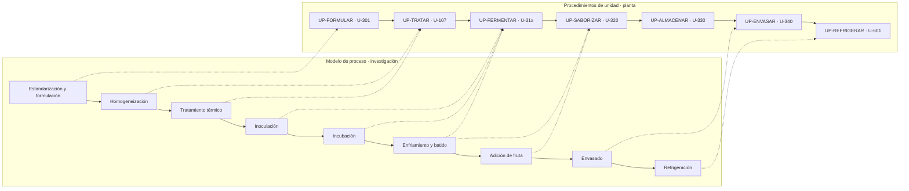
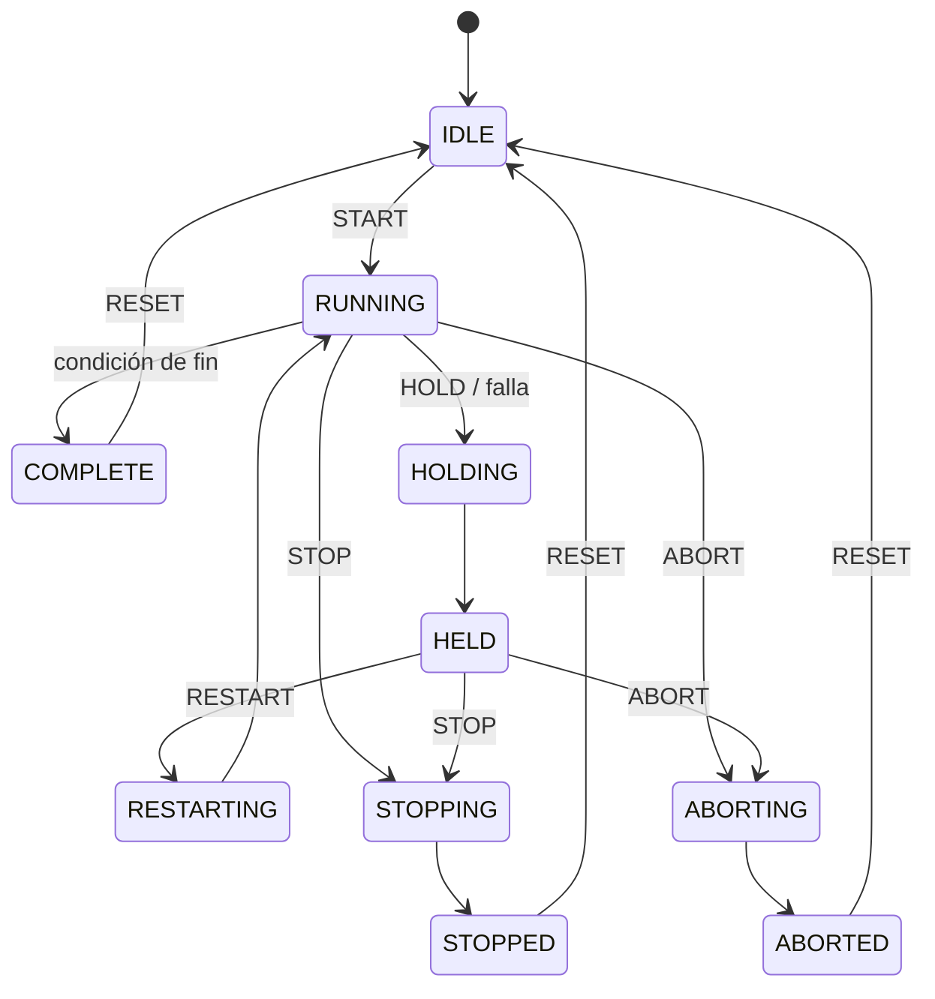
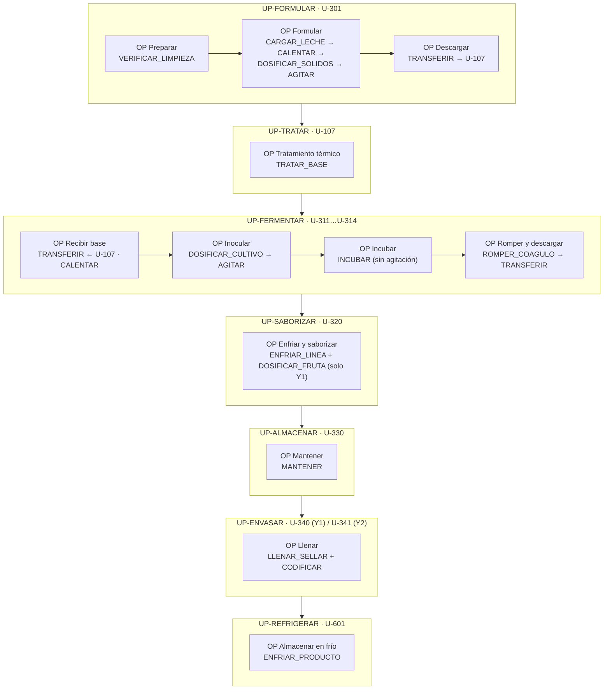

# Modelo procedimental ISA-88

El modelo procedimental responde **¿qué acciones ejecuto?** Tiene cuatro niveles:

| Nivel | Se ejecuta en | Ejemplo |
|---|---|---|
| Procedimiento | Celda de proceso | Producir un lote de yogur batido de fresa |
| Procedimiento de unidad | Una unidad | Fermentar en U-312 |
| Operación | Una unidad, sin interrupción del producto | Incubación |
| Fase | Módulos de equipo de la unidad | `INCUBAR` (T = 43 °C, pH de corte = 4,6) |

Las **fases** son el punto de contacto con el PLC: cada fase es un bloque de lógica en Logix Emulate que recibe parámetros de la receta y devuelve reportes al registro de lote.

## Del modelo de proceso (Integrante 3) al modelo procedimental

Una etapa del proceso puede repartirse entre varias unidades (enfriamiento y batido: la ruptura del coágulo ocurre en el fermentador y el enfriamiento en U-320), y una unidad puede ejecutar varias etapas (U-107 homogeniza y trata térmicamente).

## Modelo de estados de las fases

Todas las fases usan el modelo de estados de ISA-88. Es la base para el Grafcet (módulo 04) y para mostrar el estado del lote en el SCADA (módulo 07).

| Estado | Significado en planta |
|---|---|
| HOLDING / HELD | Pausa segura: el producto se mantiene en condición estable (p. ej. temperatura mantenida, agitación lenta) mientras se atiende una alarma |
| STOPPING / STOPPED | Fin ordenado: el lote se puede recuperar o reprocesar |
| ABORTING / ABORTED | Fin inmediato: el lote se declara no conforme |

## Biblioteca de fases

Cada fase se programa **una sola vez por clase de unidad** y se reutiliza en todas las unidades de esa clase y en todas las referencias. La receta solo cambia los parámetros.

### Fases de la línea de yogur (detalladas)

| Fase | Clase de unidad | Parámetros (de la receta) | Reportes (al registro de lote) | Condición de fin | Hold automático si… |
|---|---|---|---|---|---|
| `VERIFICAR_LIMPIEZA` | Todas | — | Fecha del último CIP | CIP vigente | CIP vencido |
| `CARGAR_LECHE` | Formulación | Masa objetivo (kg), silo de origen | Masa real, lote de leche | WT-301 ≥ objetivo | Desviación > 1 % |
| `CALENTAR` | Formulación, Fermentador | T objetivo, rampa máx. | T alcanzada, tiempo | TT ≥ objetivo − 0,5 °C | Tiempo máx. excedido |
| `DOSIFICAR_SOLIDOS` | Formulación | % leche en polvo, % azúcar, lotes de insumo | Masa real por insumo, lotes | WT-302 = objetivo | Desviación > 2 % |
| `AGITAR` | Formulación, Fermentador, Pulmón | rpm, tiempo | rpm medida | Tiempo cumplido | Falla de variador |
| `TRANSFERIR` | Todas | Origen, destino, cantidad | Cantidad transferida | Nivel bajo en origen | Destino lleno |
| `TRATAR_BASE` | Homog. y tratamiento (U-107) | P etapa 1, P etapa 2, T homogeneización, T tratamiento, t retención, T salida | Registro continuo de TT-107C, n.º de desvíos FDV, volumen tratado | Volumen completo | T retención < consigna (desvío FDV) |
| `DOSIFICAR_CULTIVO` | Fermentador | Tipo de cultivo, dosis (%), lote de cultivo | Masa dosificada, lote, hora de inoculación | Dosis confirmada | Sin confirmación |
| `INCUBAR` | Fermentador, Cámara de incubación | T incubación, pH de corte, t mínimo, t máximo | pH final, tiempo real, curva de pH | pH ≤ corte y t ≥ t mínimo | t > t máximo sin alcanzar pH |
| `ROMPER_COAGULO` | Fermentador | rpm, tiempo | — | Tiempo cumplido | — |
| `ENFRIAR_LINEA` | Enfriamiento y saborización | T salida | T real | Transferencia completa | T salida fuera de ±2 °C |
| `DOSIFICAR_FRUTA` | Enfriamiento y saborización | % fruta, lote de preparado | Masa de fruta, relación real | Transferencia completa | Relación fuera de ±0,5 % |
| `MANTENER` | Pulmón, Fermentador | T, rpm, t máximo | T mín/máx | Orden de la llenadora | t > t máximo |
| `LLENAR_SELLAR` | Llenadora | Formato, peso nominal, tolerancia, T sellado, cantidad | Unidades buenas, rechazadas por causa, paradas | Pulmón vacío o cantidad cumplida | Rechazos > 3 % (S) |
| `CODIFICAR` | Llenadora | Código de lote, fecha de vencimiento | — | Continuo durante llenado | Falla de impresora |
| `ENFRIAR_PRODUCTO` | Túnel de enfriamiento, Cámara fría | T objetivo, t máximo | Curva de temperatura | T producto < 6 °C | t > 12 h |

### Fases de quesos y kéfir (reutilizan la biblioteca y agregan las propias)

| Fase | Clase de unidad | Parámetros clave |
|---|---|---|
| `CALENTAR`, `AGITAR`, `TRANSFERIR`, `DOSIFICAR_CULTIVO`, `INCUBAR` | Tina quesera, Fermentador de kéfir | Reutilizadas |
| `DOSIFICAR_COAGULANTE` | Tina quesera | Dosis de cuajo (mL/10 L), dosis de CaCl₂ (g/100 L) |
| `COAGULAR` | Tina quesera | T, tiempo de reposo (sin agitación) |
| `CORTAR` | Tina quesera | Tamaño de grano (cm), rpm de liras, tiempo |
| `DESUERAR` | Tina quesera | % de suero a retirar, acidez del suero |
| `MOLDEAR` | Moldeadora-prensa | Peso por molde, T de masa |
| `PRENSAR` | Moldeadora-prensa | Presión (bar), tiempo, n.º de volteos |
| `SALAR_SALMUERA` | Tanque de salmuera | Concentración (°Bé), T, tiempo de inmersión |
| `SALAR_MASA` | Tina quesera / Moldeadora | % de sal sobre la cuajada |
| `EMPACAR` | Empacadora | Tipo (vacío/MAP), T sellado, peso nominal |
| `MADURAR` | Tanque de maduración (kéfir) | T, tiempo |

`INCUBAR` sirve para el fermentador de yogur, la cámara de incubación del yogur firme y el fermentador de kéfir: el mismo bloque de PLC con otros parámetros. Ese es el beneficio concreto de ISA-88.

## Procedimientos de la línea de yogur

Las referencias Y1 (batido con fresa) y Y2 (bebible descremado) comparten el mismo procedimiento; Y2 omite `DOSIFICAR_FRUTA` y cambia parámetros. Y3 (firme) tiene un procedimiento distinto porque fermenta dentro del envase.

### PROC-YOG-BATIDO (Y1 y Y2)

### PROC-YOG-FIRME (Y3)

| Procedimiento de unidad | Unidad | Operaciones → fases | Diferencia con Y1/Y2 |
|---|---|---|---|
| UP-FORMULAR | U-301 | Igual que Y1 | Más leche en polvo, sin azúcar |
| UP-TRATAR | U-107 | `TRATAR_BASE` | 85 °C por 5 min |
| UP-INOCULAR | U-311…U-314 | Recibir base → `DOSIFICAR_CULTIVO` → `AGITAR` → `TRANSFERIR` | **No incuba en tanque**: se descarga inoculado a 43 °C |
| UP-ENVASAR | U-341 | Cambio de formato a tarro → `LLENAR_SELLAR` + `CODIFICAR` | Llenado en caliente, máx. 60 min (S) |
| UP-INCUBAR | U-350 | `INCUBAR` | Fermenta dentro del envase |
| UP-ENFRIAR | U-351 | `ENFRIAR_PRODUCTO` | < 6 °C en ≤ 10–12 h, sin batido |
| UP-REFRIGERAR | U-601 | Almacenar a 2–4 °C | — |

### Asignación de unidades (ruta del lote)

| Referencia | Ruta |
|---|---|
| Y1 · Batido con fresa 150 g | U-301 → U-107 → U-31x → U-320 (con fruta) → U-330 → U-340 → U-601 |
| Y2 · Bebible descremado 1.000 g | U-301 → U-107 → U-31x → U-320 (sin fruta) → U-330 → U-341 → U-601 |
| Y3 · Natural firme 1.000 g | U-301 → U-107 → U-31x (solo inoculación) → U-341 → U-350 → U-351 → U-601 |

Los cuatro fermentadores permiten tener lotes en paralelo. El MES asigna el fermentador libre (`U-31x`) al crear la receta de control.

### Tiempo de ciclo estimado del fermentador (Y1) · insumo para VSM y Tecnomatix

| Operación | Duración (S) |
|---|---|
| Recibir base desde U-107 (5.000 L a 5.000 L/h) | 1,0 h |
| Inocular y dispersar | 0,25 h |
| Incubar (4–7 h según investigación) | 5,0 h |
| Romper coágulo y descargar a U-320 | 1,0 h |
| CIP | 1,5 h (S) |
| **Ciclo total** | **≈ 8,75 h** |

Observación para el Integrante 3: un lote de Y1 produce ≈ 38.600 vasos, que a 12.000 vasos/h ocupan la llenadora U-340 durante ≈ 3,2 h. La descarga del fermentador (1 h) queda limitada por el pulmón y la llenadora: **la llenadora de vasos es el candidato a cuello de botella** de la línea, y U-107 es el recurso en disputa con kéfir.

## Procedimientos de las líneas secundarias (nivel de operación y fase)

### PROC-QUESO (Q1, Q2, Q3)

| UP / Unidad | Operación | Fases |
|---|---|---|
| UP-CUAJAR · U-401/U-402 | Preparar leche | `VERIFICAR_LIMPIEZA` → `TRANSFERIR` ← U-106 → `CALENTAR` |
| | Coagular | `DOSIFICAR_COAGULANTE` → `COAGULAR` |
| | Cortar y agitar | `CORTAR` → `AGITAR` (con `CALENTAR` opcional) |
| | Desuerar | `DESUERAR` (+ `SALAR_MASA` en Q2 y Q3) |
| UP-MOLDEAR · U-403 | Moldear | `MOLDEAR` → `PRENSAR` (Q1 y Q3; Q2 sin prensado) |
| UP-SALAR · U-404 | Salar | `SALAR_SALMUERA` (solo Q1) |
| UP-EMPACAR · U-405 | Empacar | `EMPACAR` + `CODIFICAR` |
| UP-REFRIGERAR · U-601 | Almacenar | `ENFRIAR_PRODUCTO` |

### PROC-KEFIR (K1, K2, K3)

| UP / Unidad | Operación | Fases |
|---|---|---|
| UP-TRATAR · U-107 | Tratamiento de base | `TRATAR_BASE` (enfriando a 22–25 °C) |
| UP-FERMENTAR · U-501/U-502 | Inocular | `DOSIFICAR_CULTIVO` → `AGITAR` |
| | Fermentar | `INCUBAR` (18–24 h) |
| | Romper y descargar | `ROMPER_COAGULO` → `TRANSFERIR` |
| UP-MADURAR · U-503/U-504 | Madurar | `MADURAR` (K1 y K2; **K3 no madura**) |
| UP-SABORIZAR · U-505 | Saborizar | `DOSIFICAR_FRUTA` (solo K2) |
| UP-ENVASAR · U-506 | Envasar | `LLENAR_SELLAR` + `CODIFICAR` |
| UP-REFRIGERAR · U-601 | Almacenar | `ENFRIAR_PRODUCTO` |

## Procedimiento de limpieza CIP (entre lotes)

El CIP es tiempo de *setup*: entra al VSM y a la disponibilidad del OEE. Valores típicos de la industria láctea (S), por confirmar:

| Paso | Solución | T | Tiempo |
|---|---|---|---|
| Pre-enjuague | Agua | Ambiente | 5–10 min |
| Alcalino | NaOH 1,5–2 % | 75 °C | 15–20 min |
| Enjuague intermedio | Agua | Ambiente | 5 min |
| Ácido | HNO₃ 0,8–1 % | 65–70 °C | 10–15 min |
| Enjuague final | Agua potable | Ambiente | 5–10 min |

Los fermentadores hacen CIP completo después de cada lote. En U-320, U-330 y las llenadoras, el cambio de Y1 a Y2 o Y3 exige CIP completo (restos de fruta y color), mientras que lotes consecutivos de la misma referencia pueden encadenarse con enjuague (S). Esta regla alimenta la programación de producción y los tiempos de cambio de referencia.
