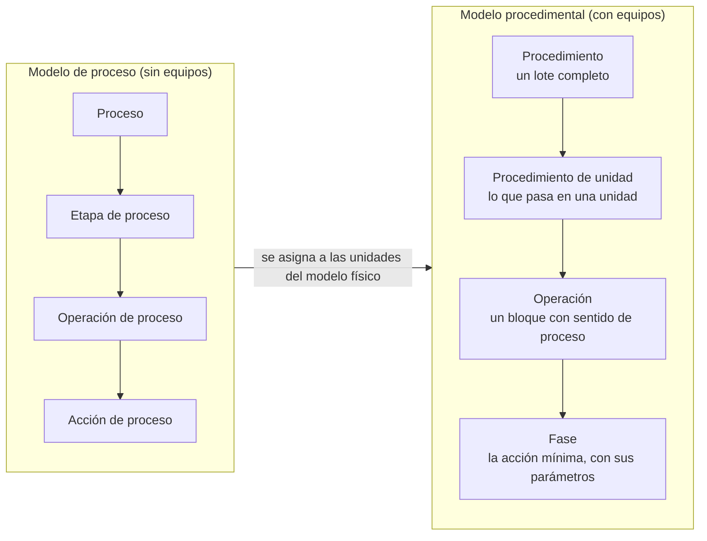
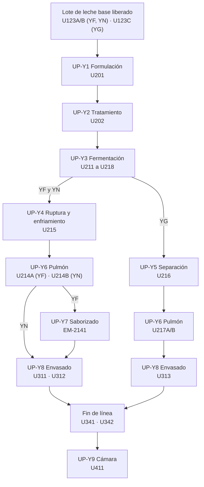
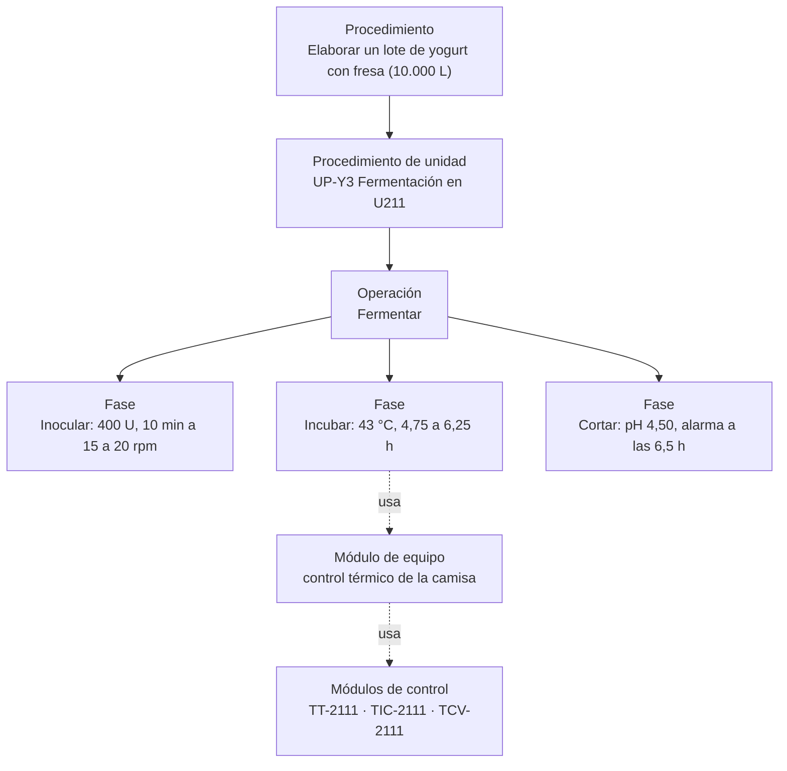
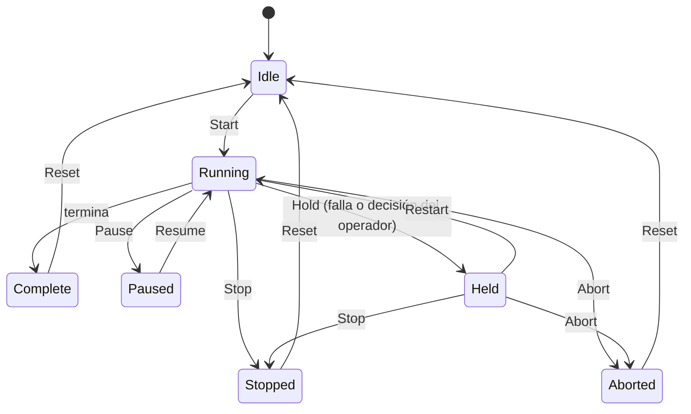

# Modelo procedimental ISA-88

El modelo procedimental responde **¿qué acciones ejecuto?** Describe cómo se fabrica un lote con los equipos del [modelo físico](../modelo-fisico/modelo-fisico.md). Antes se presenta el **modelo de proceso**, que describe lo que le pasa al producto sin mencionar equipos y es la base de la receta general.

```mermaid
flowchart LR
    subgraph MP["Modelo de proceso (sin equipos)"]
        direction TB
        P1["Proceso"] --> P2["Etapa de proceso"] --> P3["Operación de proceso"] --> P4["Acción de proceso"]
    end
    subgraph MPR["Modelo procedimental (con equipos)"]
        direction TB
        R1["Procedimiento<br/>un lote completo"] --> R2["Procedimiento de unidad<br/>lo que pasa en una unidad"] --> R3["Operación<br/>un bloque con sentido de proceso"] --> R4["Fase<br/>la acción mínima, con sus parámetros"]
    end
    MP -->|"se asigna a las unidades del modelo físico"| MPR
```

Cada **procedimiento de unidad** se ejecuta en una unidad o en un grupo de unidades iguales. Cada **fase** tiene un valor de receta y una tolerancia, y usa los módulos de equipo de la unidad. En la empresa base las fases las ejecuta el operador con los controladores locales; en la propuesta de automatización las ejecutará el PLC.

## 1. Modelo de proceso (receta general)

### Tronco común

| Etapa de proceso | Operaciones de proceso | Acciones de proceso |
|---|---|---|
| Recepción de leche cruda | Aceptar, descargar, enfriar, almacenar | Analizar la cisterna, filtrar, enfriar a 4 °C o menos, guardar máximo 24 h |
| Preparación de la leche base | Clarificar, estandarizar, pasteurizar | Calentar a 55 °C, separar la crema, ajustar la grasa al producto, calentar a 75 °C por 15 s, enfriar a 4 °C |
| Preparación de la crema | Pasteurizar y almacenar la crema | Calentar a 85 °C por 15 s, enfriar a 4 °C o menos |

### Línea de yogurts

| Etapa de proceso | Operaciones de proceso | Acciones de proceso |
|---|---|---|
| Preparación de la base | Formular, homogeneizar, tratar térmicamente | Dispersar leche en polvo (y azúcar en fresa) a 50 °C, homogeneizar, calentar a 92 °C por 5 min, enfriar a 43 °C |
| Fermentación | Inocular, incubar, cortar | Agregar el cultivo, mantener 43 °C sin agitar hasta el pH de corte |
| Acondicionamiento | Romper y enfriar (fresa y natural) o concentrar (griego) | Romper el coágulo y enfriar a 20 °C, o separar el suero, enfriar a 10 a 12 °C y añadir crema |
| Saborizado | Dosificar fruta (solo fresa) | Agregar 13 % de preparado de fresa en línea |
| Envasado | Llenar, sellar, inspeccionar | Detectar metales, llenar, sellar, pesar y codificar |
| Conservación | Enfriar y madurar | Llevar a 6 °C o menos y reposar 12 h a 2 a 4 °C |

### Línea de quesos

| Etapa de proceso | Operaciones de proceso | Acciones de proceso |
|---|---|---|
| Coagulación | Atemperar, madurar, coagular | Llevar a 32 a 35 °C, agregar cloruro de calcio, cultivo y cuajo |
| Trabajo de la cuajada | Cortar, cocinar, desuerar | Cortar en cubos de 1 a 1,5 cm, calentar a 40 a 42 °C, retirar el 85 % del suero |
| Acidificación | Acidificar la cuajada | Mantener 35 a 38 °C hasta el pH de hilado |
| Hilado | Hilar y moldear | Estirar con agua a 75 a 85 °C, moldear bloques y barras |
| Salado | Enfriar y salar | Enfriar en agua fría y salar en salmuera o en la hiladora |
| Empaque y conservación | Empacar al vacío, almacenar en frío | Detectar metales, empacar, guardar a 2 a 4 °C |

### Línea de leche UHT

| Etapa de proceso | Operaciones de proceso | Acciones de proceso |
|---|---|---|
| Preparación | Mezclar y estandarizar | Verificar la grasa; en chocolate, dispersar azúcar, cacao y carragenina a 60 a 65 °C |
| Esterilización | Precalentar, desairear, esterilizar, homogeneizar, enfriar | Calentar a 137 °C por 4 s, homogeneizar a 200/50 bar, enfriar a 20 a 25 °C |
| Envasado aséptico | Guardar en estéril, envasar | Esterilizar el envase con H₂O₂, llenar y sellar la caja de 1 L |
| Liberación | Retener y liberar | Retener el lote hasta confirmar la esterilidad |

## 2. Procedimiento de la leche base y la crema (tronco común)

Este procedimiento es común a los nueve productos. Cada procedimiento de producto empieza tomando un lote de leche base liberado de su silo.

| Procedimiento de unidad | Unidad | Operaciones | Fases y parámetros |
|---|---|---|---|
| UP-LB1 Recepción | U111/U112 → U113/U114 | Registrar, aceptar, descargar, enfriar y almacenar | Registrar la cisterna (proveedor, ruta, volumen y sellos) · Muestrear y analizar: temperatura 4 ± 2 °C, alcohol 68 % m/m (78 % v/v si va a UHT), acidez 0,13 a 0,17 %, densidad 1,030 a 1,033 g/mL, crioscopia −0,530 a −0,510 °C, antibióticos negativos (PCC-1), grasa ≥ 3,0 %, proteína ≥ 2,9 %, SNG ≥ 8,3 % · Descargar a 30 a 40 m³/h por el filtro dúplex · Enfriar a 4 °C o menos · Almacenar máximo 24 h con agitación; si va a esperar más, termizar a 63 a 65 °C por 15 s |
| UP-LB2 Estandarización y pasteurización | U121 + U122 | Clarificar, estandarizar, pasteurizar, enfriar | Precalentar a 55 °C (50 a 60 °C) en la regeneración · Separar y estandarizar a la grasa del silo destino · Pasteurizar a 75 °C por 15 s; desvío si baja de 72 °C (PCC-2) · Mantener el lado pasteurizado 0,3 bar por encima del crudo · Enfriar a 4 °C o menos |
| UP-LB3 Almacenamiento y liberación | U123A/B/C, U124A/B, U125A/B | Recibir, mantener, liberar | Llenar el silo con la grasa del siguiente producto · Mantener a 2 a 4 °C, máximo 24 h · Liberar con fosfatasa negativa y peroxidasa positiva · Transferir solo lotes liberados |
| UP-LB4 Crema | U126 → U127 | Pasteurizar, almacenar, liberar | Pasteurizar la crema al 40 % a 85 °C por 15 s; desvío si baja de 80 °C (PCC-3) · Mantener a 4 °C o menos, máximo 24 h · Liberar con fosfatasa negativa · Entregar unos 230 kg/día al griego y unos 270 L/día a la doble crema; el excedente se vende |

**Grasa de estandarización por silo destino**

| Silo | Producto | Grasa |
|---|---|---|
| U123A/B | Yogurt con fresa y natural | 3,50 % ± 0,03 |
| U123C | Yogurt griego | 0,05 % o menos |
| U124A/B | Mozzarella · quesillo · doble crema | 3,0 % · 3,2 % · 3,6 % |
| U125A | Leche entera UHT y base de la de chocolate | 3,0 % |
| U125B | Leche descremada UHT | 0,3 % |

El pasteurizador trabaja unas 10,8 h al día con los 150.000 L, contando arranques y dos lavados.

## 3. Procedimiento de la línea de yogurts

Un mismo procedimiento sirve para las tres referencias. Lo que cambia entre ellas es la receta (cantidades, pH de corte, tiempos) y la ruta por las unidades. La receta tiene nueve etapas y cada una es un procedimiento de unidad.

| Procedimiento de unidad | Unidad | Fresa (YF) | Natural (YN) | Griego (YG) |
|---|---|---|---|---|
| UP-Y1 Formulación | U201 | ✓ | ✓ | ✓ |
| UP-Y2 Tratamiento | U202 | ✓ | ✓ | ✓ |
| UP-Y3 Fermentación | U211, U212, U213 o U218 | ✓ | ✓ | ✓ |
| UP-Y4 Ruptura y enfriamiento | U215 | ✓ | ✓ | — |
| UP-Y5 Separación | U216 | — | — | ✓ |
| UP-Y6 Pulmón | U214A (YF), U214B (YN), U217A/B (YG) | ✓ | ✓ | ✓ |
| UP-Y7 Saborizado | EM-2141 a la salida de U214A | ✓ | — | — |
| UP-Y8 Envasado | U311, U312 (YF, YN) · U313 (YG) | ✓ | ✓ | ✓ |
| UP-Y9 Cámara | U411 | ✓ | ✓ | ✓ |

Esta numeración sigue las etapas del documento *Recetas y procesos de la planta*. No coincide con la de las recetas de yogurts v1.8, que agrupaban las etapas de otra forma.

```mermaid
flowchart TD
    LB["Lote de leche base liberado<br/>U123A/B (YF, YN) · U123C (YG)"] --> Y1["UP-Y1 Formulación<br/>U201"]
    Y1 --> Y2["UP-Y2 Tratamiento<br/>U202"]
    Y2 --> Y3["UP-Y3 Fermentación<br/>U211 a U218"]
    Y3 -->|"YF y YN"| Y4["UP-Y4 Ruptura y enfriamiento<br/>U215"]
    Y3 -->|"YG"| Y5["UP-Y5 Separación<br/>U216"]
    Y4 --> Y6A["UP-Y6 Pulmón<br/>U214A (YF) · U214B (YN)"]
    Y5 --> Y6B["UP-Y6 Pulmón<br/>U217A/B"]
    Y6A -->|"YF"| Y7["UP-Y7 Saborizado<br/>EM-2141"]
    Y6A -->|"YN"| Y8A["UP-Y8 Envasado<br/>U311 · U312"]
    Y7 --> Y8A
    Y6B --> Y8B["UP-Y8 Envasado<br/>U313"]
    Y8A --> F["Fin de línea<br/>U341 · U342"]
    Y8B --> F
    F --> Y9["UP-Y9 Cámara<br/>U411"]
```

### 3.1 Yogurt con fresa (YF): operaciones y fases

| Procedimiento de unidad | Operación | Fase | Valor de receta | Tolerancia o alarma |
|---|---|---|---|---|
| UP-Y1 Formulación (U201) | Cargar la base | Cargar leche desde U123A/B | 10.320 kg | ± 0,5 % |
| | | Dosificar leche en polvo y azúcar al mezclador de vacío | 444 + 626,5 kg | ± 1 % |
| | Hidratar | Dispersar e hidratar | 50 °C por 20 min | — |
| UP-Y2 Tratamiento (U202) | Homogeneizar | Desairear | 68 °C, vacío del fabricante | — |
| | | Homogeneizar en dos etapas | 200 + 50 bar a 65 a 70 °C | — |
| | Tratar térmicamente | Calentar y retener | 92 °C por 5 min | Desvío si baja de 90 °C (PCC-4) |
| | | Enfriar a temperatura de inoculación | 43 °C | ± 0,5 °C |
| UP-Y3 Fermentación (U211 a U218) | Fermentar | Inocular al iniciar el llenado y agitar | 400 U; 10 min a 15 a 20 rpm | Lote del cultivo en la planilla |
| | | Incubar sin agitación | 43 °C, unas 5,25 h | Entre 4,75 y 6,25 h |
| | | Cortar la fermentación | pH 4,50 | Alarma si pasan más de 6,5 h |
| UP-Y4 Ruptura y enfriamiento (U215) | Acondicionar | Romper el coágulo | 5 a 10 min a 20 rpm o menos | Sin incorporar aire |
| | | Enfriar en placas | 20 °C | 15 a 22 °C; vaciado en unas 1,1 h |
| UP-Y6 Pulmón (U214A) | Mantener | Mantener hasta el llenado | 18 a 22 °C | Máximo 8 h |
| UP-Y7 Saborizado (EM-2141) | Saborizar | Dosificar el preparado de fresa en línea | 13,0 % | ± 0,5 %; bolsa conectada máximo 24 h a 8 °C o menos (PCC-6) |
| UP-Y8 Envasado (U311/U312) | Envasar | Detectar metales en la tubería | Sin metal sobre el patrón | PCC-5 |
| | | Llenar, sellar y codificar | Llenado a 18 a 22 °C; mordaza a 180 a 220 °C | Peso neto según la Res. SIC 32209 de 2020 |
| UP-Y9 Cámara (U411) | Conservar | Enfriar y madurar | 6 °C o menos en 12 h; reposo de 12 h a 2 a 4 °C | Despacho FEFO |

### 3.2 Yogurt natural (YN): diferencias con el de fresa

| Procedimiento de unidad | Diferencia |
|---|---|
| UP-Y1 Formulación | Solo 357 kg de leche en polvo; sin azúcar |
| UP-Y3 Fermentación | Cultivo de baja postacidificación; corte a pH 4,50 en unas 5,0 h (4,5 a 6,0 h) |
| UP-Y6 Pulmón | Va al pulmón U214B |
| UP-Y7 Saborizado | No aplica: el dosificador EM-2141 queda aislado con válvulas para que no pase fruta |

### 3.3 Yogurt griego (YG): operaciones y fases propias

| Procedimiento de unidad | Operación | Fase | Valor de receta | Tolerancia o alarma |
|---|---|---|---|---|
| UP-Y1 Formulación (U201) | Cargar la base | Cargar leche desde U123C | 10.350 kg, sin leche en polvo | — |
| UP-Y2 Tratamiento (U202) | Homogeneizar y tratar | Homogeneizar (opcional) y tratar | 100 bar; 92 °C por 5 min; enfriar a 43 °C | PCC-4 |
| UP-Y3 Fermentación | Fermentar | Incubar | 43 °C, unas 5,5 h | Entre 5,0 y 6,5 h; corte a pH 4,55 |
| UP-Y5 Separación (U216) | Concentrar | Agitar y separar | Agitación lenta 10 a 15 min; alimentación a 40 a 42 °C y 7.000 L/h (unas 1,4 h) | Proteína del concentrado 9,6 ± 0,2 % |
| | | Enfriar el concentrado | 10 a 12 °C, de inmediato | — |
| | Restituir la grasa | Dosificar crema al 40 % desde U127 | 155 kg por lote | ± 0,1 % de grasa; solo crema de un lote liberado (PCC-3) |
| UP-Y6 Pulmón (U217A/B) | Mantener | Mantener, un pulmón por lote | 12 °C o menos | Máximo 12 h |
| UP-Y8 Envasado (U313) | Envasar | Llenar | Llenado a 10 a 12 °C; unas 3,2 h por lote | PCC-5 antes de llenar |
| UP-Y9 Cámara (U411) | Conservar | Madurar | 6 °C o menos en 12 h; reposo de 12 h a 2 a 4 °C | — |

### 3.4 Ejemplo de la jerarquía completa

```mermaid
flowchart TD
    A["Procedimiento<br/>Elaborar un lote de yogurt con fresa (10.000 L)"] --> B["Procedimiento de unidad<br/>UP-Y3 Fermentación en U211"]
    B --> C["Operación<br/>Fermentar"]
    C --> D1["Fase<br/>Inocular: 400 U, 10 min a 15 a 20 rpm"]
    C --> D2["Fase<br/>Incubar: 43 °C, 4,75 a 6,25 h"]
    C --> D3["Fase<br/>Cortar: pH 4,50, alarma a las 6,5 h"]
    D2 -.->|usa| EM["Módulo de equipo<br/>control térmico de la camisa"]
    EM -.->|usa| CM["Módulos de control<br/>TT-2111 · TIC-2111 · TCV-2111"]
```

## 4. Procedimiento de la línea de quesos

Los tres quesos son de pasta hilada y usan las mismas unidades. Cada lote es de 10.000 L de leche de U124A/B.

| Procedimiento de unidad | Unidad | Operaciones | Fases y parámetros | Tiempo por lote |
|---|---|---|---|---|
| UP-Q1 Tina | U221A, U221B o U221C | Llenar y atemperar · madurar · coagular · cortar · cocinar y desuerar | Atemperar a 32 a 35 °C en E-2210 (en doble crema se añade la crema de U127) · Agregar cloruro de calcio y cultivo; madurar 20 a 30 min con agitación lenta · Agregar el cuajo; reposar sin agitar 30 a 40 min hasta corte limpio · Cortar en cubos de 1 a 1,5 cm; reposo de 5 min · Calentar hasta 40 a 42 °C con agitación y retirar el 85 % del suero | 3,0 h más 0,5 h de lavado |
| UP-Q2 Acidificación | U222 | Acidificar la cuajada | Mantener 35 a 38 °C hasta el pH de hilado; confirmar con la prueba de estiramiento en agua caliente | 2 a 3 h |
| UP-Q3 Hilado | U223 | Hilar y moldear | Agua de hilado a 75 a 85 °C; pasta a la salida a 58 a 62 °C; en quesillo y doble crema se agrega la sal; moldeo en bloques y barras | 1,0 h (0,5 h al cambiar de queso) |
| UP-Q4 Salado | U224 | Enfriar y salar | Canal de agua fría a 4 a 10 °C · Salmuera al 20 % (18 a 22 %) de NaCl a 8 a 12 °C | Hasta 8,0 h (mozzarella) |
| UP-Q5 Empaque | U321 | Inspeccionar y empacar | Detector de metales (PCC-7) · Vacío y sellado · Etiqueta con lote, fecha y vencimiento | 1,2 h |
| UP-Q6 Cámara | U414 | Conservar | 2 a 4 °C, reposo de 12 h; transporte refrigerado a 2 a 6 °C | 12 h |

**Parámetros que cambian por referencia**

| Parámetro | Mozzarella (QM) | Quesillo (QQ) | Doble crema (QD) |
|---|---|---|---|
| Grasa de la leche | 3,0 % | 3,2 % | 3,6 % más 160 L de crema (mezcla al 4,2 %) |
| Cultivo | Termófilo, 200 U | Mesófilo, 100 U | Mesófilo, 100 U |
| Cuajo | 2,0 L | 2,0 L | 2,2 L |
| Cocción | 40 a 42 °C | 40 a 42 °C | En el límite inferior, para retener más humedad |
| pH de hilado | 5,1 a 5,3 | 5,2 a 5,3 | 5,2 a 5,3 |
| Salado | Salmuera al 20 % por 8 h | Sal al 1,5 % en la hiladora y salmuera de 1 h | Sal al 1,2 % en la hiladora; solo se enfría en agua |

La salmuera se controla una vez por turno (concentración, temperatura y pH) y se filtra y pasteuriza cada semana. Es un punto de control (PC-Q), no un PCC.

## 5. Procedimiento de la línea de leche UHT

Cada lote es de 10.000 L de U125A (entera y chocolate) o U125B (descremada). Antes de producir, la planta UHT se esteriliza con agua a temperatura de esterilización por 30 min y el tanque aséptico se esteriliza con vapor.

| Procedimiento de unidad | Unidad | Operaciones | Fases y parámetros | Tiempo por lote |
|---|---|---|---|---|
| UP-L1 Mezcla | U231 | Mezclar y estandarizar | Entera y descremada: verificar la grasa y ajustar si hace falta · Chocolate: calentar a 60 a 65 °C, premezclar la carragenina en seco con azúcar (1 a 10), agregar por la tolva con el resto del azúcar y el cacao, mezclar 20 min con recirculación | 1,0 h (0,5 h de lavado al pasar a chocolate) |
| UP-L2 Tratamiento UHT | U232 | Precalentar y desairear · esterilizar · homogeneizar · enfriar | Precalentar en la regeneración y desairear · Esterilizar a 137 °C por 4 s; si baja, se desvía y se recircula (PCC-8) · Homogeneizar a 200/50 bar a unos 70 °C · Enfriar a 20 a 25 °C | 1,0 h para todo el paso por la planta |
| UP-L3 Almacenamiento estéril | U233 | Guardar en estéril | Presión positiva con aire estéril filtrado; alimenta la envasadora sin parar la UHT | Pulmón |
| UP-L4 Envasado aséptico | U331 | Esterilizar el envase y envasar | Baño de H₂O₂ y secado con aire estéril caliente (PCC-9) · Sellar la caja de 1 L y la tapa | 2,0 h |
| UP-L5 Retención | U413 | Retener y liberar | Cajas del inicio, del medio y del final: incubación a 30 a 35 °C por 7 días y prueba rápida de ATP a las 24 a 48 h · Esterilidad comercial según NTC 4433 por auditoría | 24 h en el modelo de Tecnomatix |

**Parámetros que cambian por referencia**

| Parámetro | Entera (LE) | Descremada (LD) | Con chocolate (LC) |
|---|---|---|---|
| Silo y grasa | U125A, 3,0 % | U125B, 0,3 % | U125A, 3,0 % |
| Mezcla | Solo verificar la grasa | Solo verificar la grasa | Azúcar, cacao y carragenina a 60 a 65 °C |
| Orden en el día | Primera | Segunda | Última, por el cacao |

## 6. Fin de línea y limpieza

**Fin de línea (U341 y U342).** Las cajas se arman a la salida de cada llenadora o empacadora y se paletizan a mano, con 2 operarios por línea; la envolvedora U342 envuelve las estibas. Yogurts y quesos van a cámara fría; la leche UHT va a bodega a temperatura ambiente.

**Limpieza (U901).** Es un procedimiento propio que se ejecuta entre lotes. El operador conecta el circuito con codos en el panel y elige el programa.

| Programa | Equipos | Secuencia | Duración | Cuándo |
|---|---|---|---|---|
| CIP-C (superficies calientes) | U122, U126, U202 | Agua tibia 10 min · NaOH 0,5 a 2 % a 75 °C, 30 min · agua 5 min · HNO₃ 0,5 a 1,5 % a 70 °C, 20 min · agua fría 8 min. Antes de producir, agua a 90 a 95 °C por 10 a 15 min | 85 min | U122 dos veces al día; U202 en cada cambio de producto |
| CIP-F (superficies frías) | Cisternas, U113/U114, silos, U127, U201, fermentadores, pulmones, tinas U221, U231 y tuberías | Agua 3 min · NaOH 0,5 a 1,5 % a 75 °C, 10 min · agua 3 min · desinfección con agua a 90 a 95 °C, 5 min. Ácido una vez por semana | 45 min con llenados y drenajes | Cada vez que se vacía el equipo |
| CIP-S (separadora) | U216 | La secuencia del CIP-F, con tres descargas del bowl durante la soda y una al final | 60 min | Al terminar la corrida |
| CIP-UHT | U232, U233 | Agua 10 min · NaOH 2 % a 137 °C, 40 min · agua 10 min · HNO₃ 1 % a 105 °C, 20 min · agua y enfriamiento 20 min. Antes de producir, esterilización con agua a 137 °C por 30 min | Final 120 min; intermedia 30 min; esterilización 60 min | Al terminar la corrida del día y al pasar de chocolate a entera |
| CIP-L (máquinas) | U311 a U313, U223, U321, U331 | Agua 5 min · NaOH 1,5 % a 75 °C, 20 min · agua 5 min · HNO₃ 1 % a 65 °C, 15 min · agua 5 min · agua a 90 °C, 10 min | 75 min (105 min en U331, con esterilización) | Al final del día y en cada cambio de fresa a natural |

La velocidad en las tuberías debe estar entre 1,5 y 3,0 m/s. La concentración de soda y ácido se revisa por titulación manual y la limpieza se verifica con ATP en superficies.

## 7. Tiempos por lote

Son los mismos que usa el modelo de Tecnomatix de la planta.

| Línea | Lotes por semana | Orden en el día | Tiempos por lote |
|---|---|---|---|
| Yogurts | 35 (13 natural, 9 griego, 13 fresa) | Natural, griego, fresa | U201 1,9 h · U202 1,2 h · fermentador 8,1 a 9,0 h · U215 1,1 h · llenado unas 3,5 h |
| Quesos | 30 (10 de cada uno) | Mozzarella, quesillo, doble crema | Tina 3,5 h · hilado 1,0 h · salmuera 8,0 h · empaque 1,2 h · cámara 12 h |
| Leche UHT | 26 (14 entera, 6 descremada, 6 chocolate) | Entera, descremada, chocolate | Mezcla 1,0 h · UHT 1,0 h · envasado 2,0 h · retención 24 h |

Con estos tiempos, la simulación de 12 semanas en Tecnomatix da que el cuello de botella es la llenadora de vasos U311 (88 %) y que las líneas de quesos y leche UHT tienen capacidad libre: tinas al 24 %, hiladora al 27 % y envasadora aséptica al 40 %.

## 8. Estados, comandos y modos

ISA-88 define cómo se comporta cada procedimiento, procedimiento de unidad, operación y fase mientras se ejecuta.

```mermaid
stateDiagram-v2
    [*] --> Idle
    Idle --> Running: Start
    Running --> Complete: termina
    Running --> Paused: Pause
    Paused --> Running: Resume
    Running --> Held: Hold (falla o decisión del operador)
    Held --> Running: Restart
    Running --> Stopped: Stop
    Held --> Stopped: Stop
    Running --> Aborted: Abort
    Held --> Aborted: Abort
    Complete --> Idle: Reset
    Stopped --> Idle: Reset
    Aborted --> Idle: Reset
```

| Estado | Significado en la planta | Ejemplo |
|---|---|---|
| Idle | La fase está lista y espera la orden | Fermentador limpio esperando la base |
| Running | Se ejecuta normalmente | Incubando a 43 °C |
| Paused | Pausa en un punto seguro definido | Cambio de bolsa de preparado de fruta |
| Held | Detenida en condición segura por una falla o por el operador | La curva de pH se sale de lo esperado |
| Complete | Terminó bien | Se alcanzó pH 4,50 y se cortó la fermentación |
| Stopped | Terminó antes de tiempo, de forma ordenada | Se suspende el lote para hacer limpieza |
| Aborted | Terminó de inmediato por emergencia; el lote queda retenido | Desvío continuo en el tratamiento térmico |

El diagrama muestra los estados estables. La norma también define estados transitorios (Pausing, Holding, Restarting, Stopping y Aborting), en los que la fase ejecuta su lógica para llegar al estado siguiente de forma segura; por ejemplo, en Holding el fermentador cierra la válvula de agua caliente antes de quedar en Held.

**Modos.** Automático (el procedimiento ordena las fases según la receta), semiautomático (el operador confirma cada paso) y manual (mando individual de los módulos de control, solo para mantenimiento, con los enclavamientos activos).

**En la empresa base** no existe este modelo de estados: las fases las ejecuta el operador, y solo los tratamientos térmicos tienen una reacción automática (las válvulas de desvío FDV). Implementar estados, comandos y modos en el PLC y el SCADA es parte de la propuesta de automatización.

## 9. Recursos compartidos y reglas de uso

| Recurso | Quién lo usa | Regla en la empresa base |
|---|---|---|
| Recepción, separadora y pasteurizador (U111 a U122) | Las tres líneas | Trabajan en continuo; la grasa la fija el silo que se está llenando |
| Silos A y B de cada línea | Cada línea con su par de silos | Uno se llena con la grasa del siguiente producto mientras el otro alimenta la línea; se lavan al vaciarse |
| Crema pasteurizada (U127) | Yogurt griego y doble crema | Solo se entrega crema de un lote liberado; máximo 24 h a 4 °C o menos |
| Módulo térmico U202 | Solo la línea de yogurts | La leche UHT tiene su propia planta; U202 lleva CIP-C en cada cambio de producto |
| Fermentadores U211 a U218 | Los tres yogurts | Cada lote ocupa un fermentador libre durante su ciclo de 8,1 a 9,0 h; se lava cada vez que se vacía |
| Llenadoras U311 y U312 | Fresa y natural | Lavado completo al pasar de fresa a natural; U312 cambia de formato entre 1000 y 1750 g |
| Tinas U221A/B/C | Los tres quesos | Una tina por lote; entre quesos distintos basta un enjuague |
| Estación CIP U901 | Todas las unidades | El operador conecta con codos el circuito que va a lavar y elige el programa en el panel |
| Muelle de despacho U412 | Las tres líneas | Yogurts y quesos en camión refrigerado; leche UHT en camión seco |

**Orden de campaña.** Yogurts: natural, griego y fresa, para que ningún producto sin azúcar reciba arrastre de azúcar o de fruta. Quesos: mozzarella, quesillo y doble crema, de menor a mayor grasa. Leche UHT: entera, descremada y chocolate, porque el cacao va al final.

Fuentes: *Recetas y procesos de la planta* (procedimientos, parámetros, CIP, PCC y tiempos), *Diagramas P&ID de la empresa base* (unidades y módulos) y *Comunicación y visualización de los datos en la empresa base (ISA-95)* (estado actual del control).
