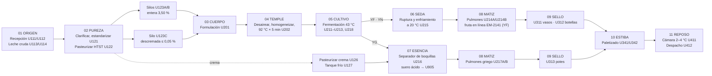

# Recetas maestras · Línea de yogures

**Lácteos Altos de Teusacá** (Sopó, Sabana de Bogotá) · Integrador: **Mekvra**, Grupo 6 · APM 2026-2S, UNAL

| Versión | Fecha | Estado | Responsable de recetas (RACI) |
|---|---|---|---|
| 1.4 | 9 de octubre de 2026 | Propuesta técnica auditada en tres ciclos (sección 14) y con riesgos investigados y resueltos (sección 13), para revisión del equipo | Luis (A/R) · elaborada por Janan Libardo |

Recetas en formato ISA-88 (IEC 61512) para los tres productos de la línea escogida en el acta del 7 de octubre: **yogur con fresa, yogur natural y yogur griego**. Cubren todo el recorrido, desde que la cisterna llega a la planta hasta el despacho. Todas las cifras de balance y de tiempos salen de [`balance_recetas_yogures.py`](balance_recetas_yogures.py), que escribe [`recetas_yogures.json`](recetas_yogures.json) y comprueba que cierren la masa total, la grasa y la proteína. El nuevo modelo de Tecnomatix de la línea de yogures leerá ese mismo archivo; el modelo actual de Tecnomatix es de la planta anterior, de tres líneas.

> Todas las cantidades son **valores de diseño**: los parámetros vienen de la literatura técnica y de la normativa citadas, y la composición de las materias primas es un supuesto declarado (sección 1). Se reemplazan por los datos del proveedor y por mediciones cuando existan. Ningún valor es un resultado medido en planta.

---

## 0. Resumen

| Código | Producto | Denominación (Res. 2310/1986, arts. 12 y 21) | Lotes/día | Producto por lote | Presentaciones |
|---|---|---|---|---|---|
| **YF** | Yogur con trozos de fresa | Yogur entero con dulce, con fresa | 3 | 13.092 kg | Vaso 150 g · botella 1000 g · botella 1750 g |
| **YN** | Yogur natural | Yogur entero sin dulce | 3 | 10.677 kg | Vaso 200 g · botella 1000 g |
| **YG** | Yogur griego | Yogur semidescremado sin dulce; en el Codex, leche fermentada concentrada | 2 | 3.242 kg | Vaso 150 g · pote 500 g |

- **Lote:** 10.000 L de leche estandarizada y pasteurizada. Son 8 lotes al día, es decir, **80.000 L/día de leche para la línea**, que salen de ≈ 82.200 L de leche cruda.
- **Producto terminado:** ≈ 77.791 kg/día (YF 39.276, YN 32.032 y YG 6.483 kg).
- **Campaña diaria:** natural ×3 → griego ×2 → fresa ×3, siempre sin dulce antes que con dulce (sección 9.3).

---

## 1. Bases de diseño

| Concepto | Valor | Origen |
|---|---|---|
| Recepción de la planta | 300.000 L/día (todas las líneas) | Acta 7-oct-2026 |
| Leche para la línea de yogures | 80.000 L/día | Acta 7-oct-2026 |
| Mezcla diaria | 3 YF · 3 YN · 2 YG (lotes de 10.000 L) | Decisión del 8-oct-2026 (por ratificar en acta) |
| Densidad a 15 °C | Entera 1,032 kg/L · descremada 1,035 kg/L | Supuesto. El Decreto 616/2006 fija 1,030–1,033 para la cruda entera; la descremada es más densa |
| Leche cruda de diseño (Holstein, Sabana) | Grasa 3,6 % · proteína 3,1 % · SNG 8,6 % | Supuesto. Mínimos legales: grasa 3,0 %, SNG 8,3 %, proteína 2,9 % |
| Crema del separador | 40 % de grasa; proteína y SNG proporcionales a la fase no grasa de la leche | Supuesto de diseño |
| Leche en polvo descremada (LPD) | ≥ 34 % de proteína, 95 % de SNG, 1 % de grasa | Ficha típica (se reemplaza por la del proveedor) |
| Calendario | 24 h/día en operación continua, 3 turnos. Arranca **un lote cada 3 h** (sección 10) | Propuesta de Pablo (8-oct); ritmo calculado en el script |
| Módulo térmico U202 | **Dedicado a la línea de yogures** | Recomendado con el análisis de carga de la sección 13. En el ISA-88 anterior (55.000 L/día) U202 era compartido con el kéfir |

### Nomenclatura

- **Unidades:** se conservan los códigos y significados del documento ISA-88 del equipo (U111…U412, U901–U905). **Ningún código existente cambia de significado.**
  - **Nuevas:** U123A/B (silos de leche entera) y U123C (silo de leche descremada), U126/U127 (crema), U215, U216, U217A/B, U218 y U313. U124 y U125 siguen siendo los silos de las otras líneas.
  - **Ampliadas:** U214, que sigue siendo el tanque pulmón y de saborización, pasa a ser dos tanques, U214A/B. U905, que ya trata el suero, recibe además el suero ácido del griego.
  - **Advertencia:** en el modelo de Tecnomatix anterior, U215 era un segundo pulmón. Ese modelo se reemplaza por el de esta línea.
- **Lotes:** los de leche base se identifican como `LB-AAMMDD-Sx-NN` y los de producto como `[referencia]-AAMMDD-NN`, por ejemplo `YG150-261009-02`.
- **Etapas:** cada etapa lleva un nombre corto, que facilita el diálogo con operarios y el material visual, y su nombre técnico ISA-88. El procedimiento de unidad conserva el código formal.

---

## 2. Mapa del proceso

| N.º | Etapa | Nombre técnico (procedimiento de unidad) | Unidades | YF | YN | YG |
|---|---|---|---|:-:|:-:|:-:|
| 01 | **ORIGEN** | Recepción y aceptación de leche cruda (UP-LB1) | U111/U112 → U113/U114 | ● | ● | ● |
| 02 | **PUREZA** | Clarificación, estandarización y pasteurización de leche y crema (UP-LB2/LB3) | U121 → U122 → U123A–C · U126 → U127 | ● | ● | ● |
| 03 | **CUERPO** | Formulación y fortificación de la base (UP-Y1) | U201 | ● | ● | ● |
| 04 | **TEMPLE** | Desaireación, homogeneización y tratamiento térmico (UP-Y2) | U202 | ● | ● | ● |
| 05 | **CULTIVO** | Inoculación y fermentación (UP-Y3) | U211–U213, U218 | ● | ● | ● |
| 06 | **SEDA** | Ruptura del coágulo y enfriamiento suave (UP-Y4) | U215 | ● | ● | — |
| 07 | **ESENCIA** | Concentración del yogur griego (UP-Y5) | U216 | — | — | ● |
| 08 | **MATIZ** | Pulmón de llenado y saborización en línea (UP-Y6) | U214A/B · U217A/B | ● | ● | ● |
| 09 | **SELLO** | Envasado, sellado e inspección (UP-Y7) | U311 · U312 · U313 | ● | ● | ● |
| 10 | **ESTIBA** | Encajonado y paletizado (UP-Y8) | U341 · U342 | ● | ● | ● |
| 11 | **REPOSO** | Enfriamiento final, maduración en frío y despacho (UP-Y9) | U411 → U412 | ● | ● | ● |
| — | **CUSTODIA** | Limpieza CIP y liberación por calidad (transversal) | U901 · laboratorio | ● | ● | ● |

---

## 3. Modelo físico de la línea (requerimientos de equipo)

| Área / celda | Unidad | Equipo | Requerimiento para la línea |
|---|---|---|---|
| A1 · Tronco común (compartido) | U111/U112 | Bahías de descarga: desaireador, filtro dúplex, caudalímetro y enfriador de placas | ≈ 82.200 L/día de cruda para yogures; salida ≤ 4 °C |
| | U113/U114 | Tanques de leche cruda aislados, con agitador | ≤ 4 °C; máximo 24 h |
| | U121 | Separadora centrífuga autolimpiante con estandarización en línea | Dos consignas de grasa: 3,50 % y ≤ 0,05 % |
| | U122 | Pasteurizador HTST de placas con regeneración y válvula de desvío (FDV) | 75 °C × 15 s |
| | **U123A/B** | Dos silos de leche entera estandarizada, cada uno con su código, en alternancia (uno se llena mientras el otro alimenta la línea o está en CIP). U124 y U125 siguen siendo los silos de las otras líneas | 2 × 40.000 L, 2–4 °C (YF y YN) |
| | **U123C** | Silo de leche descremada | 25.000 L, 2–4 °C (YG) |
| | **U126** | Pasteurizador de crema de placas con retención y FDV | 85 °C × 15 s (crema al 40 %) |
| | **U127** | Tanque de crema pasteurizada con camisa | 1.000 L, 2–4 °C |
| A2 · PC21 Yogures | U201 | Tanque de formulación de 12.000 L con mezclador de polvos al vacío de alta cizalla y celdas de carga; EM-2014: intercambiador de placas con agua caliente para calentar la carga | Carga a 20 m³/h; calentamiento en línea de 4 a 50 °C: ≈ 1,05 MW durante la carga, 518 kWh por lote y ≈ 4.150 kWh/día (sección 13) |
| | U202 | Módulo térmico de la base, dedicado a yogures: regeneración, desaireador al vacío, homogeneizador de 2 etapas (hasta 250 bar), calentador, celda de retención de 5 min y enfriador | 10 m³/h |
| | U211–U213, **U218** | Cuatro fermentadores aislados de 12.000 L con camisa, agitador de baja velocidad y pH en línea (U218 es el cuarto, nuevo) | 43 ± 0,5 °C |
| | **U215** | Módulo de ruptura y enfriamiento: bomba de lóbulos, texturizador (filtro de ranura o válvula de contrapresión) y enfriador de placas de canal ancho | 10 m³/h; salida a 20 °C |
| | **U216** | Concentración griega: separador centrífugo de boquillas, enfriador tubular y dosificación en línea de crema pasteurizada (desde U127) con medidor Coriolis | 7.000 L/h de alimentación |
| | **U214A/U214B** | Tanques pulmón higiénicos cerrados de 12.000 L, con venteo por filtro de aire estéril; dosificador de fruta EM-2141 a la salida (bomba de lóbulos, Coriolis y mezclador estático) | YF y YN, en alternancia |
| | **U217A/U217B** | Dos pulmones de griego de 4.000 L con agitador de ancla, uno por lote y en alternancia, para no mezclar lotes | Producto viscoso, ≤ 12 °C |
| A3 · Envasado | U311 | Llenadora-selladora de vasos preformados, 10 carriles | 15.000 vasos/h de 150 g · 12.000 vasos/h de 200 g |
| | U312 | Llenadora-taponadora rotativa de botellas con sellado por inducción | 4.000 bot/h de 1000 g · 2.500 bot/h de 1750 g |
| | **U313** | Llenadora de potes con dosificadores de pistón para producto viscoso | 6.000/h de 150 g · 2.400/h de 500 g |
| | Todas | Báscula de control (checkweigher), detector de metales, cámara de visión y codificador láser | Velocidad de la línea |
| | U341/U342 | Celda robotizada de encajonado y paletizado + envolvedora de estibas | Común a las tres llenadoras |
| A4 · Frío | U411/U412 | Cámara fría de 2–4 °C con aire forzado y gestión FEFO; muelle refrigerado | Producto ≤ 6 °C en ≤ 12 h: supuesto de diseño que se valida con el dimensionamiento del frío; reposo ≥ 12 h |
| A9 · Servicios | U901–U905 | CIP central (3 circuitos), vapor, agua helada/glicol, aire comprimido estéril y tratamiento de suero | U905 (existente) recibe además ≈ 14.500 kg/día de suero ácido del griego |

**Por qué U311 va a 15.000 vasos/h.** Con la velocidad anterior (12.000 vasos/h de 150 g y ≈ 10.000/h de 200 g), U311 necesita 16,2 h nominales al día. Con los factores base de la propuesta de Pablo (desempeño 0,85 · disponibilidad 0,976 · calidad 0,985, más 3,5 h de CIP, pausa y relevo) son **23,4 h de 24**: no hay margen. A 15.000/12.000 vasos/h son 13,2 h nominales y 19,7 h reales (82 %).

---

## 4. Etapas comunes (procedimiento P-LB · leche base y crema)

### 01 ORIGEN · Recepción y aceptación de leche cruda (U111/U112 → U113/U114)

| Operación | Fase | Parámetro / criterio | Valor | Control |
|---|---|---|---|---|
| Registrar | Registrar cisterna (MES) | Proveedor, ruta, volumen declarado, sellos | Completo | Sin registro no se descarga |
| Inspeccionar en plataforma | Muestrear y analizar | Temperatura | ≤ 6 °C (leche cruda enfriada: 4 ± 2 °C) | Rechazo de la cisterna |
| | | Olor, color y aspecto | Característicos, sin grumos ni materias extrañas | Rechazo |
| | | Estabilidad (prueba de alcohol al 68 %) | Negativa (no coagula) | Rechazo |
| | | Acidez titulable | 0,13–0,17 % de ácido láctico | Rechazo |
| | | Densidad a 15 °C | 1,030–1,033 g/mL | Rechazo |
| | | Crioscopia | −0,530 a −0,510 °C | Rechazo por aguado |
| | | **Residuos de antibióticos** (β-lactámicos y tetraciclinas) | **Negativo** | **PCC-1**: cisterna rechazada y proveedor bloqueado |
| | | Grasa · proteína · SNG (analizador infrarrojo) | ≥ 3,0 % · ≥ 2,9 % · ≥ 8,3 % | Pago por calidad |
| | | Recuento total y células somáticas | Especificación interna (supuesto): ≤ 100.000 UFC/mL y ≤ 400.000 cél/mL | Laboratorio (resultado diferido) |
| Descargar | Descargar | Desaireación, filtro dúplex y caudalímetro | 30–40 m³/h | ΔP en el filtro (PDT-1102) |
| Enfriar y almacenar | Enfriar | Salida del enfriador de placas | ≤ 4 °C | TT-1102 |
| | Almacenar | Tanque de leche cruda con agitación | ≤ 4 °C, máximo 24 h antes de tratarla | Si va a esperar más, termizar a 63–65 °C × 15 s **antes** de cumplir las 24 h y volver a enfriar |

### 02 PUREZA · Clarificación, estandarización y pasteurización (U121 → U122 → U123A–C; crema U126 → U127)

| Fase | Parámetro | Valor de receta | Control / alarma |
|---|---|---|---|
| Precalentar (regeneración) | Temperatura de separación | 55 °C (rango 50–60 °C) | TT-1201 |
| Clarificar y estandarizar | Grasa hacia U123A/B (YF/YN) | **3,50 %** ± 0,03 | Coriolis DT-1202 + FCV-1202 |
| | Grasa hacia U123C (YG) | **≤ 0,05 %** (descremada) | Muestreo por lote LB |
| | Crema separada | 40 % de grasa | Una parte va a U126 para el griego; el excedente sale de la línea (sección 11) |
| Pasteurizar leche (HTST) | Temperatura / tiempo | **75 °C × 15 s** (mínimo legal operativo 72 °C × 15 s) | **PCC-2**: la FDV-1212 recircula si T < 72 °C |
| | Presión diferencial en el regenerador | Lado pasteurizado > lado crudo (> 0,3 bar) | PDT-1213 |
| Pasteurizar crema (U126) | Temperatura / tiempo | **85 °C × 15 s** (mínimo 80 °C × 15 s para crema ≥ 35 % de grasa) | **PCC-3**: desvío por FDV si T < 80 °C; luego enfriar a ≤ 4 °C en U127 |
| Mantener crema (U127) | Temperatura / tiempo máximo | ≤ 4 °C · **≤ 24 h** desde la pasteurización (supuesto, se valida); CIP-F de U127 y de su línea de dosificación cada vez que se vacía, al menos una vez al día | Crema vencida: se descarta o vuelve a U126 |
| Enfriar y almacenar | Temperatura en silo | 2–4 °C, máximo 24 h | TT-1231 |
| Liberar lote LB | Fosfatasa alcalina · peroxidasa | **Fosfatasa negativa y peroxidasa positiva** (leche pasteurizada, Decreto 616/2006, art. 18) | Laboratorio; sin liberación no se transfiere |
| Liberar lote de crema | Fosfatasa alcalina | **Fosfatasa negativa**. A 85 °C la peroxidasa se inactiva, así que no se exige positiva | Laboratorio |

> La pasteurización HTST protege la leche mientras espera en el silo. La función tecnológica del yogur (desnaturalizar la proteína sérica) la cumple el tratamiento de 92 °C × 5 min de la etapa 04. La crema del griego se añade **después** de la fermentación, así que su única barrera térmica es U126: por eso tiene su propio PCC.

---

## 5. Receta maestra YF · Yogur con trozos de fresa

**Encabezado.** Receta YF · versión 1.4 · referencias YF150, YF1000 y YF1750 · lote nominal 10.000 L de leche (10.320 kg), mínimo 8.000 L y máximo 10.500 L (la base del lote máximo ocupa ≈ 11 m³ de los 12 m³ del fermentador) · celda PC21 · estado: propuesta.

### 5.1 Fórmula por lote

| Materia prima | Especificación | kg por lote | % del producto |
|---|---|---:|---:|
| Leche entera estandarizada (silo U123A/B) | 3,50 % grasa · 3,10 % proteína · 8,61 % SNG | 10.320 | 78,8 |
| Leche en polvo descremada | ≥ 34 % proteína, grado lácteo | 444 | 3,4 |
| Azúcar (sacarosa) | Refinada, grado alimentario | 626,5 | 4,8 |
| Preparado de fresa en trozos | Ver especificación abajo | 1.702 | 13,0 |
| Cultivo DVS (*S. thermophilus* + *L. delbrueckii* subsp. *bulgaricus*) | Congelado o liofilizado de inoculación directa | 400 U (40 U/1.000 L)* | — |
| **Total producto** | | **13.092** | **100,0** |

\*Valor de diseño para costos. **Especificación funcional de la dosis** (sección 13): la dosis correcta es la que lleva la base de pH 6,5 a pH 4,50 en 5,0–5,5 h a 43 °C. Se fija con curvas de acidificación del cultivo elegido, porque las unidades DVS no son comparables entre proveedores.

**Base fermentada** (antes de la fruta): 11.390 kg con 11,5 % de SNG y 5,5 % de azúcar.

**Sin estabilizantes, gelificantes ni emulsificantes añadidos.** El art. 19 de la Res. 2310/1986 solo los permite en la leche fermentada de larga vida, y nombra expresamente la pectina. La textura sale de los sólidos lácteos (fortificación con LPD) y del tratamiento a 92 °C.

**Preparado de fresa (especificación de compra):**
- Preparado de etiqueta limpia: ≥ 50 % de fresa en trozos de 8–10 mm, ≈ 35 % de sacarosa añadida y **fibra de cítricos ≤ 2 % como espesante**. La fibra de cítricos es un ingrediente, no un aditivo; la receta comercial de referencia de CP Kelco usa 1,65 % con 30 °Bx. La otra opción es un preparado solo de fruta y azúcar (Zentis).
- **Sin pectina, almidón modificado ni otros gelificantes añadidos, y sin conservantes** (se excluye el sorbato que algunas recetas comerciales ponen como opcional).
- pH 3,4–3,8.
- Pasteurizado y envasado asépticamente por el proveedor (bolsa aséptica de 1.000 kg). Se conecta al dosificador con conector aséptico, sin abrir el envase al ambiente.
- Antes de comprarlo se pide concepto a regulatorio/INVIMA sobre el preparado (art. 19, parágrafo 2).
- **El preparado entra después del último tratamiento térmico de la línea**, así que tiene su propio control, **PCC-6** (sección 9.2):
  - Recepción con proveedor aprobado, certificado por lote del proceso térmico validado (temperatura y tiempo) y envase íntegro.
  - Bolsa conectada máximo 24 h a ≤ 8 °C (supuesto, según la ficha del proveedor).
  - Muestreo por lote para mohos y levaduras.

### 5.2 Procedimiento y parámetros

| Etapa | Fase | Parámetro | Valor de receta | Tolerancia / alarma |
|---|---|---|---|---|
| 03 CUERPO (U201) | Cargar leche | Desde U123A/B (consume un lote LB) | 10.320 kg | ± 0,5 % (WT-2011) |
| | Dosificar sólidos | LPD y azúcar al mezclador de vacío | 444 + 626,5 kg | ± 1 % (WT-2012) |
| | Dispersar e hidratar | Temperatura / tiempo | 50 °C / 20 min. La leche se calienta en línea durante la carga, en el intercambiador de placas del módulo EM-2014 (supuesto de diseño) | 45–55 °C. Supuesto de diseño: la base pasa ≤ 2 h por encima de 10 °C en U201, contando la transferencia a U202 |
| 04 TEMPLE (U202) | Desairear | Entrada al desaireador | 68 °C | Vacío según el proveedor |
| | Homogeneizar | Presión etapa 1 + etapa 2 / temperatura | 200 + 50 bar / 65–70 °C | ± 10 bar (PT-2021/2022) |
| | Tratar térmicamente | Temperatura / retención | **92 °C × 5 min** | **PCC-4**: la FDV-2024 recircula si T < 90 °C |
| | Enfriar a inoculación | Salida hacia el fermentador | 43 °C | ± 0,5 °C (TT-2026) |
| 05 CULTIVO (U211–U213, U218) | Inocular | Cultivo DVS al inicio del llenado; agitar | 10 min a 15–20 rpm | Lote del cultivo verificado por código de barras |
| | Incubar | Temperatura sin agitación | 43 °C | 42–44 °C |
| | Cortar fermentación | **pH de corte** | **4,50** (Tetra Pak: 4,2–4,5) | Alarma si t > 6,5 h (sospecha de fagos o falla del cultivo); Held si el pH no baja según la curva |
| | | Acidez titulable de la base al corte | **≥ 0,90 %** de ácido láctico | Laboratorio |
| | | Tiempo de referencia | ≈ 5,25 h | 4,75–6,25 h |
| 06 SEDA (U215) | Romper coágulo | Agitación lenta | 5–10 min a ≤ 20 rpm | Sin incorporar aire |
| | Enfriar | Salida del enfriador de placas | 20 °C (rango 15–22 °C) | Vaciado del tanque en ≈ 1,1 h |
| 08 MATIZ (U214A/B) | Mantener | Temperatura / permanencia en el pulmón | 18–22 °C / **≤ 8 h (supuesto, se valida con curvas de pH y viscosidad)** | Tetra Pak: minimizar el tiempo en pulmón. Si se excede: Held y decisión de calidad |
| | Saborizar en línea | Dosis de preparado de fresa | **13,0 %** de la mezcla | ± 0,5 % (Coriolis FT-2141) |
| 09 SELLO | Envasar | Temperatura de llenado | 18–22 °C | Ver sección 8 |
| 11 REPOSO | Enfriar y madurar | Producto ≤ 6 °C y reposo en cámara | ≥ 12 h a 2–4 °C | Liberación antes del despacho |

### 5.3 Especificación del producto terminado

| Parámetro | Diseño YF | Requisito | Norma |
|---|---|---|---|
| Grasa láctea | 2,79 % | ≥ 2,5 % (yogur entero) | Res. 2310/1986, art. 13 |
| Proteína láctea | 3,60 % | ≥ 2,7 % | Codex CXS 243-2003 |
| SNG lácteos | 10,0 % | ≥ 7,0 % | Res. 2310/1986, art. 13 |
| Acidez titulable | ≈ 0,86 %: la base aporta 0,90 × 0,87 = 0,78 % y el preparado ≈ 0,08 % (estimado). Criterio de liberación: **≥ 0,75 %** medido en el producto con fruta | 0,70–1,50 % (Res. 2310) · ≥ 0,6 % (Codex) | Ambas |
| pH de liberación | 4,2–4,5 | — | Tetra Pak (yogur batido) |
| Fruta neta | 6,5 % | ≥ 3 % | Res. 2310/1986, art. 20 |
| Azúcar añadida | 9,3 % (sacarosa de la base + del preparado) | Se declara en la etiqueta | Res. 810/2021, modificada por la Res. 2492/2022 |
| Sellos frontales (estimación) | **«ALTO EN AZÚCARES»**: los azúcares libres son ≈ 37 % de la energía. **No lleva el sello de grasas saturadas**, porque no se añade grasa (art. 32: el sello aplica solo al nutriente añadido) | Umbral: azúcares libres ≥ 10 % de la energía | Res. 810/2021, modificada por la 2492/2022 y corregida por la 254/2023; se confirma con análisis nutricional |
| *S. thermophilus* + *L. bulgaricus* viables | Requisito de diseño: ≥ 10⁷ UFC/g al final de la vida útil (se verifica en el estudio de vida útil) | ≥ 10⁷ UFC/g | Codex CXS 243-2003 |
| Fosfatasa | Negativa | Negativa | Res. 2310/1986 |
| Microbiología | Ver sección 9.2 | | Res. 1407/2022 |
| Vida útil | **30 días a 2–6 °C**. La acidez al vencimiento queda ≈ 0,86 + 0,30 = 1,16 %. Se confirma con el protocolo de la sección 13.3 | ≤ 1,50 % al vencimiento | Tetra Pak: 21–30 días por debajo de 8 °C en líneas de alta higiene |
| Denominación | «Yogur entero con dulce, con fresa» | | Res. 2310/1986, art. 21 |

---

## 6. Receta maestra YN · Yogur natural

**Encabezado.** Receta YN · versión 1.4 · referencias YN200 y YN1000 · lote nominal 10.000 L (10.320 kg), máximo 10.500 L · celda PC21 · estado: propuesta.

### 6.1 Fórmula por lote

| Materia prima | Especificación | kg por lote | % del producto |
|---|---|---:|---:|
| Leche entera estandarizada (silo U123A/B) | 3,50 % grasa · 3,10 % proteína · 8,61 % SNG | 10.320 | 96,7 |
| Leche en polvo descremada | ≥ 34 % proteína | 357 | 3,3 |
| Cultivo DVS suave, de baja postacidificación (*S. thermophilus* + *L. bulgaricus*) | Inoculación directa | 400 U | — |
| **Total producto** | | **10.677** | **100,0** |

Es un producto de etiqueta limpia: leche, leche en polvo y cultivo. No lleva azúcar, saborizantes, estabilizantes ni fruta.

### 6.2 Procedimiento y parámetros (diferencias con YF)

| Etapa | Fase | YN | Comentario |
|---|---|---|---|
| 03 CUERPO | Dosificar sólidos | LPD 357 kg; sin azúcar | SNG 11,5 % en la base |
| 04 TEMPLE | Homogeneizar / tratar térmicamente | Igual que YF: 200 + 50 bar · 92 °C × 5 min (PCC-4) · salida a 43 °C | |
| 05 CULTIVO | pH de corte | **4,50**, igual que YF | El cultivo de baja postacidificación evita que el producto siga bajando de pH en la cámara; el sabor suave lo da el cultivo |
| | Tiempo de referencia | ≈ 5,0 h | 4,5–6,0 h |
| 06 SEDA | Ruptura y enfriamiento | 20 °C | Igual que YF |
| 08 MATIZ | Saborizar | **No aplica.** El dosificador EM-2141 queda en derivación y aislado con válvulas a prueba de mezcla | El YN es el primer producto de la campaña (sección 9.3) |
| 09–11 | Envasar, paletizar y reposar | Igual que YF | |

### 6.3 Especificación del producto terminado

| Parámetro | Diseño YN | Requisito | Norma |
|---|---|---|---|
| Grasa láctea | 3,42 % | ≥ 2,5 % | Res. 2310/1986 |
| Proteína láctea | 4,14 % | ≥ 2,7 % | Codex CXS 243-2003 |
| SNG | 11,5 % | ≥ 7,0 % | Res. 2310/1986 |
| Acidez titulable | 0,85–1,05 % (supuesto); liberación ≥ 0,75 % | 0,70–1,50 % | Res. 2310/1986 |
| pH de liberación | 4,2–4,5 | — | Tetra Pak |
| Azúcar añadida | 0 % | — | |
| Sellos frontales | **Exento**: no se le añade sal, azúcar ni grasa | Art. 2.2 k | Res. 810/2021, modificada por la 2492/2022 |
| Cultivo viable | Requisito de diseño: ≥ 10⁷ UFC/g al final de la vida útil | ≥ 10⁷ UFC/g | Codex |
| Vida útil | **30 días a 2–6 °C** (acidez al vencimiento ≈ 1,25 %; protocolo 13.3) | ≤ 1,50 % | |
| Denominación | «Yogur entero sin dulce» (nombre comercial: natural) | | Res. 2310/1986, art. 21 |

---

## 7. Receta maestra YG · Yogur griego

**Encabezado.** Receta YG · versión 1.4 · referencias YG150 y YG500 · lote nominal 10.000 L de leche descremada (10.350 kg), máximo 10.500 L · celda PC21 · estado: propuesta.

El yogur griego industrial se hace **concentrando** un yogur de leche descremada: un separador centrífugo de boquillas retira el suero ácido hasta la proteína objetivo y después se restituye la grasa con crema pasteurizada. Es el método de GEA y Tetra Pak, que conserva el cultivo vivo; no usa termización después de la fermentación. El Codex lo clasifica como *leche fermentada concentrada* (proteína ≥ 5,6 %). En Colombia se denomina como yogur según la Res. 2310 (sección 7.3).

### 7.1 Fórmula y balance por lote

| Corriente | kg por lote | Grasa | Proteína | Destino |
|---|---:|---:|---:|---|
| Leche descremada (silo U123C) | 10.350 | 0,05 % | 3,21 % | Formulación, sin fortificar |
| Cultivo DVS **de pH estable (baja postacidificación) y baja producción de exopolisacáridos** | 400 U | | | Limita la subida de acidez en la vida útil y mejora la separación del suero |
| → Concentrado del separador U216 | 3.087 | 0,10 % | 9,60 % | Pasa a la restitución de grasa |
| → **Suero ácido** (pH 4,4–4,6) | 7.263 | 0,03 % | 0,5 % (medido: 0,41–0,68 %) | U905: valorización |
| Crema pasteurizada al 40 % (de U127) | 155 | 40 % | 1,9 % | Restituye la grasa (5,0 % del concentrado) |
| **Yogur griego (producto)** | **3.242** | **2,00 %** | **9,23 %** | Pulmón U217A o U217B (uno por lote) → U313 |

- **Consumo por kg de producto:** 3,19 kg de leche descremada y 2,24 kg de suero ácido. La referencia de la industria es ≈ 3 kg de leche por kg de griego y 2–3 kg de suero por kg (GEA; *Foods* 2022, 11, 3953).
- **Rendimiento:** 0,32 kg de producto por litro de leche descremada.

### 7.2 Procedimiento y parámetros

| Etapa | Fase | Parámetro | Valor de receta | Tolerancia / alarma |
|---|---|---|---|---|
| 03 CUERPO (U201) | Cargar leche | Desde U123C | 10.350 kg | Sin fortificación: la proteína la da la concentración |
| 04 TEMPLE (U202) | Homogeneizar | Leche descremada | Opcional (en derivación); si se usa, 100 bar | |
| | Tratar térmicamente | Temperatura / retención | **92 °C × 5 min** | **PCC-4** |
| | Enfriar a inoculación | Salida | 43 °C | ± 0,5 °C |
| 05 CULTIVO | Incubar | Temperatura | 43 °C | 42–44 °C |
| | Cortar fermentación | **pH de corte** | **4,55** | Alarma si t > 7 h |
| | | Tiempo de referencia | ≈ 5,5 h | 5,0–6,5 h |
| | Agitar | Coágulo homogéneo antes de separar | 10–15 min, lento | Sin grumos (protege las boquillas) |
| 07 ESENCIA (U216) | Separar | Temperatura de alimentación | **40–42 °C** (temperatura de fermentación) | 30–45 °C admisible |
| | | Caudal de alimentación | 7.000 L/h (el fermentador se vacía en ≈ 1,4 h) | Proteína del concentrado por NIR en línea o laboratorio: 9,6 ± 0,2 % |
| | Enfriar el concentrado | Salida del enfriador tubular | 10–12 °C, inmediatamente | Detiene la acidificación |
| | Restituir grasa | Crema pasteurizada al 40 % desde U127, dosificada en línea | 5,0 % del concentrado (155 kg/lote) | ± 0,1 % de grasa en el producto; lote de crema liberado (PCC-3) |
| | Desviar suero | Suero ácido a U905 | 7.263 kg/lote | Medido (FT) para el balance |
| 08 MATIZ (U217A/B) | Mantener | Temperatura / permanencia | ≤ 12 °C / ≤ 12 h (supuesto, se valida); un pulmón por lote | Agitador de ancla lento. U313 tarda ≈ 3,2 h nominales por lote, y el siguiente lote YG llega 3 h después: por eso hay dos pulmones |
| 09 SELLO (U313) | Envasar | Temperatura de llenado | 10–12 °C | Dosificador de pistón |
| 11 REPOSO | Enfriar y madurar | Producto ≤ 6 °C | ≥ 12 h a 2–4 °C | Liberación |

### 7.3 Especificación del producto terminado

| Parámetro | Diseño YG | Requisito | Norma |
|---|---|---|---|
| Proteína láctea | **9,23 %** | ≥ 5,6 % (leche fermentada concentrada) | Codex CXS 243-2003 |
| Grasa láctea | 2,00 % | ≥ 1,5 % (semidescremado) | Res. 2310/1986, art. 13 |
| SNG lácteos | ≈ 13 % (estimado: proteína 9,2 % + lactosa y minerales) | ≥ 7,0 % | Res. 2310/1986 |
| Acidez titulable | **≈ 1,15 % al día 1.** El griego colado industrial de vaca con 8,6–9,6 % de proteína mide 1,09–1,17 %, porque el ácido láctico sale con el suero (*Foods* 2022). El 1,9 % reportado para yogures fortificados no aplica al colado. **Liberación ≤ 1,20 %**; con cultivo de pH estable y 21 días de vida útil queda ≤ 1,50 % al vencimiento (sección 13) | 0,70–1,50 % | Res. 2310/1986 |
| pH de liberación | 4,3–4,6 | — | |
| Cultivo viable | Requisito de diseño: ≥ 10⁷ UFC/g al final de la vida útil | ≥ 10⁷ UFC/g | Codex |
| Azúcar añadida | 0 % | — | |
| Sellos frontales (estimación) | Probable **«ALTO EN GRASAS SATURADAS»**: la grasa saturada es ≈ 17 % de la energía y la crema añadida cuenta como grasa añadida. Se confirma con regulatorio | ≥ 10 % de la energía | Res. 810/2021, modificada por la 2492/2022, art. 32 |
| Vida útil | **21 días a 2–6 °C**. Es más corta que la de YF/YN porque con cultivo estándar el griego centrifugado sube hasta +0,78 % de acidez en 21 días (Yang y Yoon, 2022). Se extiende a 30 días si el protocolo 13.3 lo demuestra | ≤ 1,50 % al vencimiento | |
| Denominación legal | **«Yogurt griego natural semidescremado», con el descriptor «yogurt concentrado por separación del suero».** Ingredientes: leche descremada pasteurizada, crema de leche pasteurizada y cultivos lácticos; sin espesantes. «Griego» es veraz porque el producto sí es colado (Res. 5109/2005, art. 4: el rótulo no puede ser falso ni engañoso). Precedente: Colanta, Pasco y Alpina venden yogurt griego en Colombia | | Res. 2310/1986, arts. 12 y 21 · Res. 5109/2005 · Codex: leche fermentada concentrada |

**Suero ácido:** 14.526 kg/día. No se vierte (alta carga orgánica). Opciones a evaluar: concentración por ósmosis inversa, uso en alimentación animal o biogás.

---

## 8. Envasado, fin de línea y frío (09 SELLO · 10 ESTIBA · 11 REPOSO)

### 8.1 Presentaciones (recetas de envasado)

| Referencia | Envase | Llenadora | Velocidad nominal | % del lote | Unidades/lote | Unidades/día | Unidades/caja | Horas nominales/lote |
|---|---|---|---:|---:|---:|---:|---:|---:|
| **YF150** | Vaso PP termoformado, tapa foil termosellada | U311 | 15.000/h | 45 | 39.276 | 117.828 | 24 | 2,62 |
| **YF1000** | Botella PEAD, tapa rosca y sello de inducción | U312 | 4.000/h | 35 | 4.582 | 13.747 | 12 | 1,15 |
| **YF1750** | Botella PEAD con asa, tapa rosca y sello de inducción | U312 | 2.500/h | 20 | 1.496 | 4.489 | 6 | 0,60 |
| **YN200** | Vaso PP termoformado, tapa foil termosellada | U311 | 12.000/h | 40 | 21.355 | 64.064 | 24 | 1,78 |
| **YN1000** | Botella PEAD, tapa rosca y sello de inducción | U312 | 4.000/h | 60 | 6.406 | 19.219 | 12 | 1,60 |
| **YG150** | Vaso PP con foil y sobretapa | U313 | 6.000/h | 60 | 12.966 | 25.933 | 24 | 2,16 |
| **YG500** | Pote PP con foil y sobretapa | U313 | 2.400/h | 40 | 2.593 | 5.187 | 12 | 1,08 |

Las horas son a velocidad nominal; el modelo de Tecnomatix añade desempeño, fallas, CIP y cambios de formato.

### 8.2 Parámetros de envasado

| Fase | Parámetro | Valor | Control |
|---|---|---|---|
| Preparar | Cambio de formato | Según el SMED de la llenadora | Verificación de la primera unidad |
| Llenar | Peso neto | Nominal, con control metrológico de producto preempacado | Báscula WT-3111. Norma: Res. SIC 32209/2020 (Circular Única, Título VI), que derogó la Res. 16379/2003 y fue prorrogada 4 años por la Res. 51039 de 2026, y OIML R 87 |
| Sellar vasos (U311, U313) | Temperatura de mordaza | 180–220 °C según el foil | TT-3111; prueba de hermeticidad por turno |
| Tapar botellas (U312) | Sello de inducción | Según la potencia del cabezal | Visión AE-3112 |
| Inspeccionar | **Detector de metales de tubería**, en el producto a granel justo antes de cada llenadora. El foil de aluminio de los vasos impide detectar metales no ferrosos con un detector de túnel después de sellar | Patrones definidos en la validación del equipo | **PCC-5**: válvula de rechazo automática y verificación cada hora. Opcional: rayos X después de sellar |
| Codificar | Lote y fecha de vencimiento | `YF150-261009-03` · «Vence: DD/MM/AA» | Visión: código legible |
| Rotular | Sellos frontales y tabla nutricional | Según los análisis (secciones 5.3, 6.3 y 7.3) | Res. 810/2021 y 2492/2022 |

### 8.3 Fin de línea y cámara

| Etapa | Fase | Valor | Control |
|---|---|---|---|
| 10 ESTIBA (U341/U342) | Encajonar y paletizar | Patrón de estiba por referencia; envolver la estiba | Etiqueta logística por estiba (lote, cantidad) |
| 11 REPOSO (U411) | Enfriar y madurar | Producto ≤ 6 °C en ≤ 12 h (zona de aire forzado; supuesto que se valida al dimensionar el frío) y reposo ≥ 12 h a 2–4 °C | Registro continuo de la cámara |
| | Liberar | Liberación por calidad: pH, acidez y sensorial; microbiología por muestreo | Lote en retención hasta liberarse |
| | Despachar (U412) | FEFO; transporte refrigerado a 2–6 °C | Temperatura del vehículo al cargar |

---

## 9. CUSTODIA · Limpieza, plan HACCP y secuencia de producción

### 9.1 Programas CIP (U901)

Parámetros de Tetra Pak (*Dairy Processing Handbook*, capítulo de limpieza). La concentración exacta la da el proveedor del detergente. Velocidad en tuberías de 1,5–3,0 m/s, prerenjuague a ≤ 55 °C y conductividad y temperatura de retorno registradas.

| Programa | Equipos | Secuencia | Duración aprox. |
|---|---|---|---|
| **CIP-C** Superficies calientes | U122, U126, U202 | Agua tibia 10 min → NaOH 0,5–2 % a 75 °C, 30 min → agua 5 min → HNO₃ 0,5–1,5 % a 70 °C, 20 min → agua fría → enfriamiento gradual 8 min. Antes de producir: agua a 90–95 °C, 10–15 min | ≈ 85 min |
| **CIP-F** Superficies frías | U201, fermentadores, U214A/B, U215, EM-2141 (línea de fruta), U217A/B, U127, tuberías | Agua 3 min → NaOH 0,5–1,5 % a 75 °C, 10 min → agua 3 min → desinfección con agua a 90–95 °C, 5 min. Ácido 1 vez por semana o según la inspección | ≈ 45 min, incluidos llenados, drenajes y calentamiento (fermentador: 0,75 h por lote) |
| **CIP-S** Separador | U216 | CIP-F del circuito + descargas de lodos del bowl según el fabricante | Al terminar la campaña YG |
| **CIP-L** Llenadoras | U311–U313 | Programa CIP/SIP del fabricante | Una vez al día, al pasar de YF al YN del día siguiente. De YN a YF basta un empuje y un enjuague. U312 cambia además de formato (1000 ↔ 1750 g) en cada lote YF: 0,75 h actual y 0,33 h con SMED, tiempos que modela Tecnomatix |

- **Frecuencia de U202:** procesa ≈ 1,2 h de cada 3 h y pasa los huecos circulando agua caliente, así que está en servicio todo el día. Lleva **tres CIP-C al día, uno en cada cambio de producto**: después del tercer lote (YN → YG), del quinto (YG → YF) y del octavo (YF → YN). La corrida más larga, tres lotes, dura ≈ 7,2 h, por debajo de la corrida máxima supuesta de 10 h (se valida con la ΔP). Cada CIP-C (≈ 1,4 h) cabe en el hueco de ≈ 1,8 h entre lotes.
- **Frecuencia del resto:** fermentadores, U214A/B y U217A/B, CIP-F cada vez que se vacían, es decir, después de cada lote. U201, U215 y la línea de fruta EM-2141, CIP-F una vez al día, en la transición YF → YN. U127, cada vez que se vacía y al menos una vez al día.
- **Pulmones U214A/B y U217A/B:** son tanques **higiénicos**, no asépticos. Para que fueran asépticos necesitarían esterilización con vapor (SIP), que no está prevista.

### 9.2 Plan HACCP de la línea (resumen)

| PCC | Etapa | Peligro | Límite crítico | Monitoreo | Acción correctiva |
|---|---|---|---|---|---|
| **PCC-1** | 01 ORIGEN | Químico: residuos de antibióticos | Prueba negativa | Kit rápido por cisterna | Rechazar la cisterna; bloquear al proveedor |
| **PCC-2** | 02 PUREZA | Biológico: patógenos vegetativos en la leche | ≥ 72 °C × 15 s | TT-1212 continuo + FDV; tiempo asegurado por caudal constante (bomba de tiempo FT-1214 con alarma de caudal alto) | Desvío automático; reprocesar |
| **PCC-3** | 02 PUREZA (U126/U127) | Biológico: patógenos en la crema que se añade después de la fermentación | ≥ 80 °C × 15 s; crema ≤ 4 °C y ≤ 24 h en U127 | TT continuo + FDV y caudalímetro con alarma en U126; registro de la temperatura y la hora en U127 | Desvío; la crema no se libera |
| **PCC-4** | 04 TEMPLE | Biológico: supervivencia de patógenos y flora competitiva | ≥ 90 °C × 300 s | TT-2024 continuo + FDV; caudal FT-2025 con alarma (garantiza la retención) | Desvío automático; el lote no pasa al fermentador |
| **PCC-5** | 09 SELLO | Físico: metales | Sin metal ≥ patrón validado | Detector de tubería antes de cada llenadora; verificación cada hora | Rechazo automático; reinspeccionar desde la última verificación conforme |
| **PCC-6** | 08 MATIZ (recepción y conexión del preparado de fresa) | Biológico: mohos, levaduras y patógenos en un ingrediente añadido después del último tratamiento térmico | Proceso térmico validado del proveedor con certificado conforme por lote · envase íntegro · conectado ≤ 24 h a ≤ 8 °C | Revisión del certificado y del envase en recepción; registro de la hora de conexión | Rechazar el lote del preparado; si se excede el tiempo conectado, desconectar y desechar el remanente |

**Puntos de control (PC):**
- pH de corte y curva de fermentación.
- Acidez del producto con fruta.
- Temperatura y tiempo en los pulmones.
- Integridad del sello.
- Cadena de frío ≤ 6 °C.
- Verificación de la limpieza (ATP en superficies después del CIP).

**Criterios microbiológicos del producto** (Res. 1407/2022, numeral 1.11, leche fermentada): coliformes n = 5, c = 2, m = 10, M = 10² UFC/g · mohos y levaduras n = 5, c = 2, m = 2×10², M = 5×10² UFC/g · *E. coli* n = 5, c = 0, < 10 UFC/g.

### 9.3 Secuencia diaria de campaña

**YN ×3 → YG ×2 → YF ×3, un lote cada 3 h, en ciclo continuo.**

- **Sin dulce antes que con dulce:** el natural y el griego van antes de la fresa. Así nunca entra arrastre de azúcar ni de fruta en un producto sin dulce.
- **Cambios entre productos:**
  - De YN a YG y de YG a YF: CIP-C de U202 y empuje con agua en U201.
  - **De YF a YN** (fin del ciclo diario): CIP completo de U201, U202, U215, EM-2141 y las llenadoras, para que no pase azúcar ni fruta al yogur sin dulce. El primer YN espera en su pulmón mientras termina el CIP de la llenadora (≈ 1,5 h, dentro del límite de 8 h).
  - El separador U216 recibe su CIP-S al terminar los dos lotes YG, mientras siguen los YF.
- **Fermentadores:** CIP-F después de cada lote (0,75 h), sin importar el producto.

---

## 10. Tiempos de ciclo (insumo para Tecnomatix)

| Unidad | Fase | YF | YN | YG |
|---|---|---:|---:|---:|
| U201 | Cargar (20 m³/h) + dispersar e hidratar 0,33 + transferir a U202 (10 m³/h) | 1,91 h | 1,85 h | 1,82 h |
| U202 | Tratar la base (10 m³/h) + empuje 0,15 | 1,23 h | 1,17 h | 1,14 h |
| Fermentador | Llenar + inocular 0,17 + incubar + romper/agitar + vaciar + CIP 0,75 | **8,49 h** (1,08 + 0,17 + 5,25 + 0,15 + 1,08 + 0,75; los sumandos están redondeados) | **8,10 h** (1,02 + 0,17 + 5,0 + 0,15 + 1,02 + 0,75) | **9,03 h** (0,99 + 0,17 + 5,5 + 0,20 + separar 1,42 + 0,75) |
| U215 | Romper y enfriar (= vaciado) | 1,08 h | 1,02 h | — |
| U216 | Separar (7.000 L/h) + arranque 0,25 | — | — | 1,67 h |

**Carga diaria nominal:**
- Fermentadores: 67,8 h-tanque. Con 4 tanques es el **71 %** del día; con 3 sería el **94 %**, sin margen para la variación del pH de corte.
- U201: 14,9 h (62 %).
- U202: 9,5 h (39 %).
- Llenadoras (horas nominales/día): U311 **13,2 h** · U312 **10,0 h** · U313 **6,5 h**.

**Ritmo: un lote cada 3 h (24 h / 8 lotes).** El script simula tres días seguidos con este ritmo y nunca hay más de **4 fermentadores ocupados a la vez**, aunque el ciclo más largo (YG, 9,03 h) dura tres ritmos. Por eso:
- U201 trabaja ≈ 1,9 h de cada 3 h, y la base nunca espera fermentador. El límite de ≤ 2 h por encima de 10 °C se cumple.
- U202 trabaja ≈ 1,2 h de cada 3 h y deja un hueco de ≈ 1,8 h, donde caben sus dos CIP-C diarios.

Con las pérdidas de la propuesta de Pablo, U311 tarda ≈ 3,2 h reales por lote YF, más que el ritmo de 3 h. En los tres YF seguidos se acumulan ≈ 0,6 h, que absorbe el pulmón (≤ 8 h), y se recuperan en los YN, que solo necesitan ≈ 2,2 h.

Si los lotes se encadenaran sin esperar (uno cada 1,9 h), los fermentadores se saturarían y la base esperaría caliente en U201. **El MES solo debe arrancar U201 cuando haya un fermentador libre para ese lote.** Tecnomatix verificará el ritmo con las llenadoras y las fallas.

**Lead time de referencia por lote:**
- YF/YN: de la salida del silo al último envase, ≈ 10–11 h; luego ≥ 12 h de reposo en cámara.
- YG: ≈ 11–12 h; luego ≥ 12 h de reposo.

---

## 11. Balance diario de la línea

| Entradas | Cantidad/día | Salidas | Cantidad/día |
|---|---:|---|---:|
| Leche cruda | 82.179 L (84.809 kg) | Yogur con fresa YF | 39.276 kg |
| Leche en polvo descremada | 2.403 kg | Yogur natural YN | 32.032 kg |
| Azúcar | 1.879 kg | Yogur griego YG | 6.483 kg |
| Preparado de fresa | 5.106 kg | Suero ácido (U905) | 14.526 kg |
| Cultivo DVS | 3.200 U | Crema excedente al 40 % (a otras líneas) | 1.880 kg |
| **Total** | **94.197 kg** | **Total** | **94.197 kg** |

- **Cierre:** el balance cierra exacto en masa total, grasa (3.077 kg) y proteína (3.446 kg); el script lo verifica cada vez que corre. Las cifras individuales están redondeadas, y se supone que el preparado de fresa no aporta grasa ni proteína.
- **Leche a la línea:** 80.000 L, de los cuales 60.000 L son entera (61.920 kg) y 20.000 L descremada (20.700 kg).
- **Fuera del balance:** las mermas de proceso (arranques, empujes con agua, rechazos y producto retenido en líneas). Se miden en el piloto (KPI de la propuesta de Pablo).

---

## 12. Cambios frente a la receta anterior de fresa (29-sep)

| Receta anterior | Esta versión | Motivo |
|---|---|---|
| Estabilizante 1 % y emulsificante 0,3 % | Ninguno, y preparado de fruta sin pectina añadida | La Res. 2310/1986 (art. 19) solo admite gelificantes y emulsificantes, pectina incluida, en la leche fermentada de larga vida |
| Fruta 3 % | Preparado 13 % (fruta neta 6,5 %) | Con 3 % de *preparado* la fruta neta queda por debajo del 3 % que exige el art. 20 |
| Pasteurización de la base 85 °C × 5 min | **92 °C × 5 min** | Tetra Pak recomienda 90–95 °C × 5 min: desnaturaliza 70–80 % de la proteína sérica y da cuerpo sin estabilizantes |
| Homogeneización ≈ 192 bar a 60 °C | 200 + 50 bar a 65–70 °C | Rango de Tetra Pak: 200–250 bar a 65–70 °C |
| Inoculación e incubación a 42 °C, corte a pH 4,6 | 43 °C; corte a pH 4,50 (YF, YN) y 4,55 (YG, para separar) | Tetra Pak: 42–43 °C y pH final ≈ 4,2–4,5 |
| Enfriamiento < 15 °C y luego 4 °C en el tanque | Enfriamiento suave a 15–22 °C en placas; el producto llega a ≤ 6 °C en la cámara | Enfriar el yogur batido a 4 °C en el tanque daña la viscosidad (Tetra Pak: 15–22 °C antes de llenar) |
| Leche semidescremada | Leche estandarizada al 3,50 % | Con leche semidescremada la grasa del producto no llega al 2,5 % de «entero» |
| Una sola receta | Tres recetas (YF, YN, YG) y siete referencias | Alcance del acta del 7-oct |

---

## 13. Riesgos y su resolución (investigación del 9 de octubre)

Cada riesgo abierto en la versión 1.3 se investigó en fuentes primarias. La tabla muestra la evidencia, la resolución que ya queda escrita en la receta y lo único que no se puede cerrar sin planta: la confirmación en la prueba piloto.

| N.º | Riesgo | Evidencia | Resolución en la receta (v1.4) | Queda para el piloto |
|---|---|---|---|---|
| 1 | Acidez del griego mayor de 1,50 % (Res. 2310) | Griego colado industrial de vaca, con 8,6–9,6 % de proteína: acidez **1,09–1,17 %** al día 1, y el suero se lleva 0,45–0,52 % (*Foods* 2022, 11, 3953). El ácido láctico sale con el suero, así que el 1,9 % de los yogures fortificados no aplica. El riesgo está en el almacenamiento: con cultivo estándar sube hasta +0,78 % en 21 días a 4 °C (Yang y Yoon, *Foods* 2022) | **Cultivo de pH estable** (baja postacidificación; existen comerciales, p. ej. YoFlex Acidifix, y cepas deficientes en lactosa). Separar a 40–42 °C y enfriar a ≤ 10 °C de inmediato. **Liberación ≤ 1,20 %** al día 1 y **vida útil de 21 días**: 1,20 + 0,30 ≤ 1,50 % | Medir la subida real de acidez; si a 30 días queda ≤ 1,50 %, extender la vida útil a 30 días |
| 2 | Composición real de la leche cruda | Mínimo legal (Decreto 616/2006 y Decreto 1880/2011) y dos estudios regionales (tabla 13.1) | Las recetas cumplen en **todos** los casos, incluido el mínimo legal. Si la cruda trae menos de 3,5 % de grasa, U121 remezcla crema propia (sobra crema del descremado del griego) | Promedio real de los proveedores para ajustar la LPD |
| 3 | Preparado de fresa sin gelificantes añadidos | Existen preparados de etiqueta limpia: solo fruta y azúcar (Zentis) o con fibra de cítricos como espesante (CP Kelco: 1,65 % de fibra, 20 % de trozos, 30 °Bx) | Especificación: ≥ 50 % de fresa, sacarosa y **fibra de cítricos ≤ 2 % como ingrediente**; sin pectina, almidón modificado ni conservantes | Concepto del INVIMA sobre la fibra de cítricos; prueba de sinéresis |
| 4 | Uso del término «griego» | Res. 5109/2005, art. 4 (mod. Res. 557/2022): el rótulo no puede presentar el producto de forma falsa o engañosa. El griego tradicional se obtiene colando el suero, que es este proceso. Colanta, Pasco y Alpina venden «yogurt griego» en Colombia | **«Yogurt griego natural semidescremado — yogurt concentrado por separación del suero»**, sin espesantes; ingredientes: leche descremada, crema y cultivos | Radicar el rótulo con el registro sanitario |
| 5 | Dosis del cultivo | Las unidades DVS no son comparables entre proveedores: 1 U/100 L en un producto, 10 g/100 L en otro | **Especificación funcional:** la dosis que lleve la base a pH 4,50 en 5,0–5,5 h a 43 °C (YF/YN) y a 4,55 en ≈ 5,5 h (YG). Las 400 U/lote quedan como valor de diseño para costos | Curvas de acidificación con el cultivo elegido |
| 6 | Vida útil y cultivo viable | Yogur control a 4 °C: +0,28 % de acidez del día 1 al 21 y casi nada del 21 al 28. *L. bulgaricus* puede caer después de unos 20 días. Tetra Pak: 21–30 días en líneas higiénicas | **YF y YN, 30 días; YG, 21 días.** Protocolo de validación en la sección 13.2 | Ejecutar el protocolo |
| 7 | U202 dedicado o compartido | Carga calculada: 8 lotes × ≈ 1,2 h + 3 CIP-C × 1,4 h = 13,7 h/día, en ventanas fijas cada 3 h. Quedan 5 huecos libres de ≈ 1,8 h | **Dedicado** (recomendado): sin arbitraje y con los CIP alineados a los cambios de producto. Compartirlo con el kéfir es posible solo en los 5 huecos (≤ 5 lotes de kéfir/día de ≤ 1,2 h), con arbitraje en el MES y enjuague entre bases | Decisión del equipo al definir el kéfir |
| 8 | Calor para la carga de U201 a 50 °C | m·cp·ΔT = 10.320 kg × 3,93 kJ/(kg·K) × 46 K = **518 kWh por lote** | EM-2014: intercambiador de placas de **≈ 1,05 MW** (carga en 0,5 h), con agua caliente de U902; **≈ 4.150 kWh/día** | Balance de energía de la planta |
| 9 | Vigencia de la Res. SIC 32209/2020 | La SIC expidió la **Res. 51039 de 2026**, que prorroga 4 años el reglamento metrológico de preempacados | Se cita la 32209/2020, prorrogada por la 51039/2026 | — |
| 10 | Proteína del suero del separador (nuevo) | Suero ácido industrial de vaca: **0,41–0,68 %** de proteína (*Foods* 2022). La versión 1.3 suponía 0,3 % | Se usa **0,5 %**. El griego baja a **3.242 kg/lote** (3,19 kg de leche por kg) y el balance sigue cerrando exacto | Datos del fabricante del separador |
| 11 | Ritmo de un lote cada 3 h | — | Se verifica en el modelo de Tecnomatix (siguiente tarea) | — |
| 12 | Mezcla 3/3/2 y destino del suero y la crema | Son decisiones del equipo y del negocio | Siguen como propuesta | Acta del equipo |

### 13.1 Sensibilidad a la composición de la leche cruda

Calculada con [`sensibilidad_leche.py`](sensibilidad_leche.py), que recalcula el balance completo para cada leche sin tocar `recetas_yogures.json`.

| Leche cruda | Grasa / proteína / SNG | Grasa YF · YN | Proteína YF | LPD YF · YN (kg/lote) | Griego (kg/lote) | Crema propia sobrante (kg/día) |
|---|---|---|---|---|---|---|
| Diseño (supuesto) | 3,60 / 3,10 / 8,60 % | 2,79 · 3,42 % | 3,60 % | 444 · 357 | 3.242 (9,23 % prot.) | 1.880 |
| Manizales, 42 muestras* | 3,39 / 3,44 / 9,47 % | 2,81 · 3,44 % | 3,62 % | 338 · 252 | 3.654 | 1.353 |
| García Rovira, 440 muestras* | 3,69 / 3,31 / 8,62 % | 2,79 · 3,42 % | 3,76 % | 440 · 354 | 3.506 | 2.064 |
| **Mínimo legal** (Dec. 616 y 1880) | 3,00 / 2,90 / 8,30 % | 2,78 · 3,41 % | 3,53 % | 487 · 401 | 2.971 | 531 |

\*Valores tomados de una fuente secundaria (resúmenes de estudios regionales); no hay datos publicados para la Sabana. Lo que resuelve el riesgo es la fila del **mínimo legal**: la peor leche que se puede aceptar en recepción sigue dando YF y YN enteros (≥ 2,5 % de grasa), un griego con proteína ≥ 5,6 % y crema propia suficiente.

### 13.2 Protocolo de vida útil

| Elemento | Definición |
|---|---|
| Muestras | 3 lotes por producto, en el envase final (YF150, YN200, YG150) |
| Temperaturas | 4 °C (real) y 8 °C (abuso de cadena de frío) |
| Días de análisis | 1, 7, 14, 21, 28 y 35 (YF, YN); 1, 7, 14, 21 y 28 (YG) |
| Análisis | pH, acidez titulable, *S. thermophilus* y *L. bulgaricus* (UFC/g), mohos y levaduras, coliformes, sinéresis y panel sensorial |
| Criterio de aceptación | Acidez ≤ 1,50 %, cultivo ≥ 10⁷ UFC/g, criterios de la Res. 1407/2022 y sensorial aceptable |
| Vida útil declarada | El último día que cumple a 4 °C, menos un margen de seguridad del 10 % |

---

## 14. Auditoría

Revisión adversarial con revisores independientes de contexto limpio, instruidos para encontrar errores, no para aprobar.

### Ciclo 3 (sobre la versión 1.2, un revisor) · corregido en la versión 1.3

Sin hallazgos críticos. Se corrigió:
- **Acidez del griego:** declarada como riesgo en la versión 1.3 y resuelta con evidencia medida en la versión 1.4 (sección 13).
- **Crema en U127:** límite de 24 h a ≤ 4 °C y CIP.
- **Detector de metales:** pasa a la tubería antes de cada llenadora, porque el foil de aluminio impide detectar metales no ferrosos después de sellar.
- **CIP:** frecuencias de cada equipo, con U215 y EM-2141 incluidos, y CIP completo en la transición YF → YN.
- **U202:** tres CIP-C al día, uno en cada cambio de producto (corrida máxima de 7,2 h).
- **PCC-2, PCC-3 y PCC-4:** monitoreo de caudal.
- **Silos:** U123A/B para leche entera y U123C para descremada, cada uno con su código.
- **Termización:** se hace antes de las 24 h, no después.
- **Cambio de formato de U312:** declarado.
- **Redondeos y página:** corregidos.

Con este ciclo se alcanzó el tope de tres ciclos de la auditoría. Lo que no se puede cerrar sin datos de planta o del proveedor queda en la sección 13.

### Ciclo 2 (sobre la versión 1.1, un revisor) · corregido en la versión 1.2

- **Crítico:** el preparado de fresa entraba después del último tratamiento térmico sin control propio → PCC-6.
- **Sellos frontales:** el YN está exento (art. 2.2 k); el YF solo lleva «ALTO EN AZÚCARES», porque el sello aplica al nutriente añadido (art. 32); el YG probablemente lleve el de grasas saturadas por la crema.
- **Peroxidasa:** a 85 °C se inactiva, así que no se exige positiva en la crema.
- **Códigos:** U213 no es nueva, U905 ya existe y U215 tenía otro significado en el modelo de Tecnomatix anterior.
- **Pulmón del griego:** uno solo no alcanzaba para dos lotes seguidos → U217A/B.
- **Ritmo:** los fermentadores se saturaban si los lotes se encadenaban → un lote cada 3 h.
- **U202:** necesita un CIP intermedio → dos CIP-C al día.
- **CIP de llenadoras:** ahora uno diario, al pasar de YF a YN.
- **Acidez y SNG del griego:** quedan como supuestos.
- **pH de corte:** 4,50 en YF/YN, coherente con el cultivo de baja postacidificación.
- **Script:** verifica el cierre de grasa y proteína.
- **Enlace de la Res. SIC 32209/2020:** corregido.

### Ciclo 1 (sobre la versión 1.0, dos revisores: proceso/normativa y balance/consistencia) · corregido en la versión 1.1
- Crema cruda añadida al griego después del último tratamiento térmico: se agregan la pasteurización de crema U126/U127 y el PCC-3.
- Pectina del preparado de fresa, en contradicción con el art. 19 de la Res. 2310.
- Acidez del yogur con fresa diluida por debajo de 0,70 %.
- Norma SIC derogada (16379/2003 → 32209/2020).
- Res. 2492/2022 y sellos frontales.
- Peroxidasa positiva en la liberación.
- Orden de la campaña (el griego sin dulce iba después de la fresa).
- Tanques llamados «asépticos» sin SIP.
- Código U214 reutilizado con otro significado.
- Lote máximo sin holgura.
- Denominación del griego.
- Densidad de la leche descremada.
- Azúcar diaria mal sumada (1.878 → 1.879 kg).
- Redondeos de YN y del rendimiento del griego.
- Dosis de crema expresada sobre la base equivocada.
- Tiempos de U201 sin la transferencia y con la hidratación contradictoria.
- Ciclo de fermentación sin la ruptura ni la agitación.
- Justificación de U311 que no se sostenía con las cifras del documento.
- Silo U123A/B sin holgura.
- Validaciones del script.

**Decisiones de diseño declaradas:**
- U202 dedicado a yogures.
- Operación continua con un lote cada 3 h.
- Control del preparado de fruta en recepción (PCC-6), en lugar de un pasteurizador de fruta propio.

---

## 15. Fuentes

- Tetra Pak. *Dairy Processing Handbook*, cap. 13 (productos lácteos fermentados) y cap. de limpieza. https://dairyprocessinghandbook.tetrapak.com/chapter/fermented-milk-products · https://dairyprocessinghandbook.tetrapak.com/chapter/cleaning-dairy-equipment
- Tetra Pak. *Precision pasteurization – your path to perfect yoghurt*. https://www.tetrapak.com/en-us/insights/cases-articles/precision-pasteurization
- Tetra Pak. Separadores de boquillas. https://tetrapak.com/en-gr/solutions/integrated-solutions-equipment/processing-equipment/separation/nozzle-separators
- GEA. *Strained yoghurt* (Fresh Cheese Uncovered). https://www.gea.com/en/campaigns/fresh-cheese-uncovered/strained-yoghurt/
- GEA. Separadores de boquillas para queso fresco y yogur. https://www.gea.com/es/products/centrifuges-separation/centrifugal-separator/nozzle-separator/nozzle-separators-fresh-cheese-cream-yoghurt
- Budhkar et al. (2014), *Cream and butter* (pasteurización de crema según la FIL: hasta 80 °C × 15 s para crema ≥ 35 % de grasa). https://elearning.unite.it/pluginfile.php/203132/mod_resource/content/0/Budhkar%20et%20al.%202014-%20Cream%20and%20butter.pdf
- *Foods* (MDPI) 2022, 11(24), 3953: suero ácido del yogur griego. https://www.mdpi.com/2304-8158/11/24/3953
- Packaging Insights. Ósmosis inversa del suero de yogur griego. https://www.packaginginsights.com/news/reverse-osmosis-of-greekstyle-yogurt-whey.html
- Codex Alimentarius. CXS 243-2003, Norma para leches fermentadas. https://www.fao.org/input/download/standards/400/CXS_243s.pdf
- Ministerio de Salud. Decreto 616 de 2006 (reglamento técnico de la leche). https://www.funcionpublica.gov.co/eva/gestornormativo/norma.php?i=21980
- Ministerio de Salud. Resolución 2310 de 1986 (derivados lácteos). https://normograma.invima.gov.co/compilacion/docs/resolucion_minsalud_2310_1986.htm
- Ministerio de Salud. Resolución 1407 de 2022 (criterios microbiológicos). https://normograma.invima.gov.co/normograma/compilacion/docs/resolucion_minsaludps_1407_2022.htm
- Ministerio de Salud. Resolución 810 de 2021, modificada por la Resolución 2492 de 2022 y corregida por la Resolución 254 de 2023 (etiquetado nutricional y frontal). https://normograma.invima.gov.co/normograma/compilacion/docs/resolucion_minsaludps_2492_2022.htm
- Ministerio de Salud. Resolución 2674 de 2013 (BPM).
- Superintendencia de Industria y Comercio. Resolución 32209 de 2020 (control metrológico). https://normograma.invima.gov.co/normograma/compilacion/docs/resolucion_superindustria_32209_2020.htm · Nota de derogación de la Res. 16379 de 2003: https://normas.cra.gov.co/Gestor/Docs/resolucion_superindustria_16379_2003.htm
- *Foods* (MDPI) 2022, 11(24), 3953: composición del yogur griego colado y su suero (acidez y proteína medidas). https://pmc.ncbi.nlm.nih.gov/articles/PMC9778196/
- Yang y Yoon (2022), *Foods* 11(23), 3799: pH y acidez del yogur griego en 21 días a 4 °C. https://pmc.ncbi.nlm.nih.gov/articles/PMC9740215/
- Chr. Hansen, YoFlex Acidifix (cultivo de pH estable). https://www.foodnavigator.com/Article/2015/10/05/pH-stable-culture-will-revolutionize-yogurt-production-says-Chr-Hansen/
- CP Kelco, receta de preparado de fruta con fibra de cítricos. https://www.cpkelco.com/wp-content/uploads/2024/05/cpk-website-cf-yogurt-fruit-prep-recipe-card-2024.pdf · Zentis, preparados de etiqueta limpia. https://zentis.com/B2B/Sales-Unterlagen_B2B/pdf_GB/GB_Zentis_Clean%20Label.pdf
- Ministerio de Salud. Resolución 5109 de 2005 (rotulado), art. 4 modificado por la Resolución 557 de 2022. https://normograma.invima.gov.co/compilacion/docs/resolucion_minsaludps_0557_2022.htm
- La República: Colanta, Pasco y Alpina y el yogurt griego en Colombia. https://www.larepublica.co/empresas/colanta-pasco-y-alpina-quieren-replicar-exito-estadounidense-del-yogurt-griego-2085161
- SIC, Resolución 51039 de 2026 (prórroga de la 32209/2020). https://www.tuv.com/regulations-and-standards/en/colombia-resolution-51039-of-2026-extends-the-validity-of-colombia-s-technical-metrology-regulation-for-prepackaged-products.html · https://www.fenalco.com.co/blog/juridico-2/notijuridico-077-sic-amplia-la-vigencia-de-la-regulacion-para-productos-preempacados-8979
- ANSI/ISA-88.00.01 (IEC 61512-1). *Batch Control – Models and Terminology*.
- Documentos del equipo: ISA88_Planta_Lactea_MEVKRA, Receta yogurt de fresa (29-sep), Acta 7-10-2026, Propuesta de automatización para Lácteos Altos de Teusacá e ISA-95 de la empresa base (Pablo, 8-oct).
