# Simulación en Tecnomatix Plant Simulation

Modelos de la planta láctea en Plant Simulation 2404 (licencia estudiantil), generados con SimTalk desde Python por la interfaz COM.

| Archivo | Contenido |
|---|---|
| `planta_lactea_base.spp` | Escenario base: tiempos antes de la propuesta (incubación de 7 h, kéfir con 24 h de fermentación y 24 h de maduración en tanque, liberación manual, un pulmón). |
| `planta_lactea_prop.spp` | Escenario propuesto: fin de fase por pH, segundo pulmón U215, 4º fermentador de kéfir U235, maduración en envase, SMED, relevos y TPM. |
| `planta_lactea_3d.spp` | Vitrina 3D del escenario propuesto (estilo del ejemplo Factory51): planta con nave, pisos de color por línea, silos, fermentadores, cámaras frías, bodega con estanterías, camiones cisterna que descargan en el punto de acopio, montacargas, camiones de despacho en el muelle y 8 operarios que caminan a sus puestos. Misma lógica y resultados que `planta_lactea_prop.spp`. |
| `construir_modelo.py` | Script que construye el modelo (con fallas y analizador de cuellos), lo corre y guarda los resultados. |
| `correr_experimentos.py` | Experimentos de capacidad (incubación, mezcla, pulmones, fermentadores, fallas). |
| `colores_3d.py` | Orden SimTalk que colorea por línea la vista 3D de los modelos base y propuesto. |
| `cuellos_base.png`, `cuellos_propuesta.png` | Analizador de cuellos de botella después de 30 días. |
| `construir_vitrina_3d.py` | Construye la lógica de la vitrina (70 de 80 objetos de la licencia estudiantil) y la corre 30 días. |
| `vitrina_post3d.py` | Genera las órdenes SimTalk que se aplican después de crear la escena 3D: colores, puestos de trabajo, vehículos, acopio, muelle y planta. |
| `vitrina_vehiculos.py`, `vitrina_decoracion.py`, `vitrina_planta_deco.py`, `vitrina_colores.txt` | Camiones, montacargas, acopio, muelle, nave, bodega y árboles hechos con figuras 3D de SimTalk (`createCuboid`, `createConeFrustum`). |
| `dibujar_iconos.py` e `iconos/` | Iconos a color de cada equipo (se cargan con `setIconFromFile`). |
| `resultados/` | Resultados de 30 días con demanda y experimentos de capacidad. |

## Cómo abrirlo

En Plant Simulation, abre el archivo con File → Open. Abajo aparecen dos pestañas:

- **.Models.Model (2D):** cada equipo tiene un icono propio y un color por línea (rosa yogur, azul kéfir, amarillo mozzarella, gris U202 compartida).
- **3D .Models.Model:** la escena 3D con los equipos coloreados. Se navega con la rueda del ratón (acercar) y el botón derecho (mover).

Presiona Start en el EventController; se simulan 30 días.

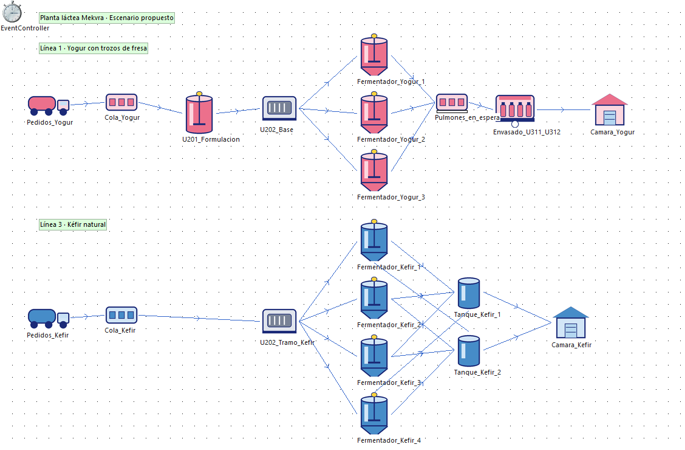
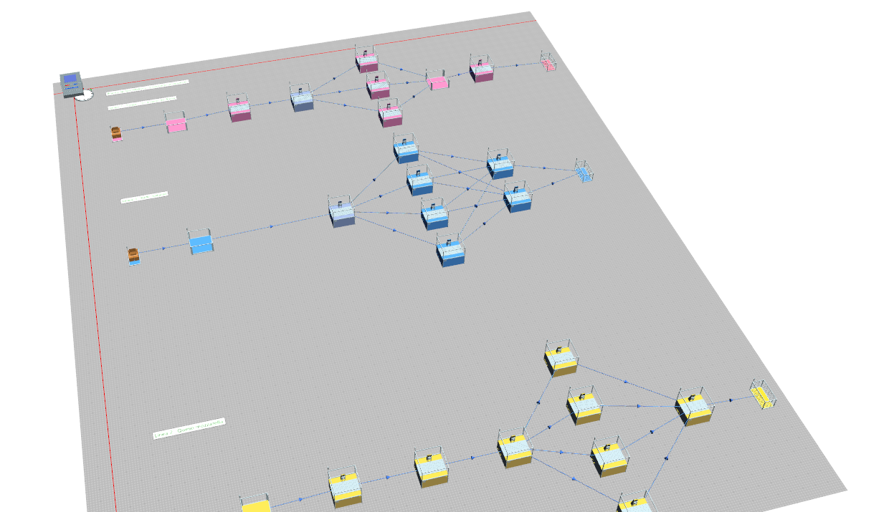

### Vitrina 3D

Abre `planta_lactea_3d.spp`, ve a la pestaña **3D .Models.Model** y presiona Start. En la cinta 3D, View → View All encuadra toda la planta; Shadows y Sky mejoran la vista. Rueda del ratón para acercar, botón central para girar y botón derecho para mover.

Cada 2,4 h llega un camión cisterna (cabina roja, tanque de acero), entra al punto de acopio techado, descarga 0,45 h con la bomba y la manguera conectadas a los tanques de leche cruda, y sale. Los camiones de despacho (cabina azul, furgón refrigerado) cargan en el muelle, y el montacargas recorre la bodega de producto terminado.

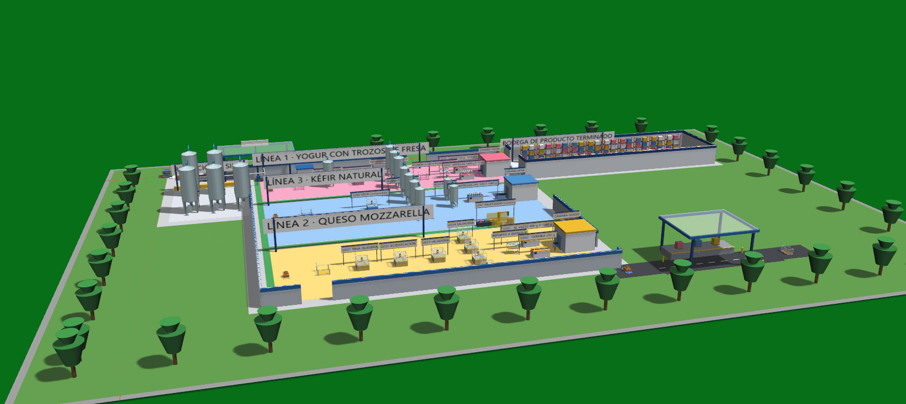
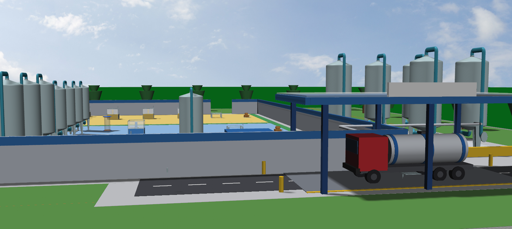
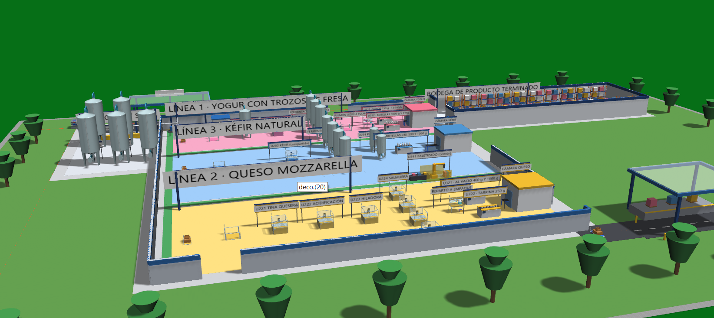
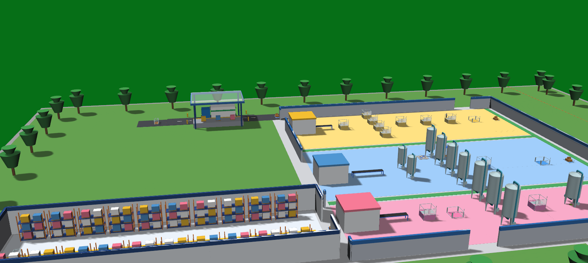
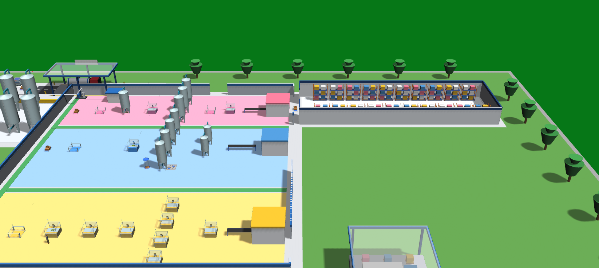

Para regenerarla: `python construir_vitrina_3d.py vitrina.spp`, abrir el archivo, crear la escena con Open 2D/3D (gráficos por defecto), y ejecutar en orden las órdenes `post_XX.txt` que genera `python vitrina_post3d.py`.

Limitaciones: los vehículos y la decoración son figuras simples (cajas y cilindros), no los modelos de la librería de Siemens: esos están en los ejemplos como Factory51, pero la licencia estudiantil no deja abrirlos para copiarlos porque pasan de 80 objetos. Los muros de la nave van a media altura para que se vea el interior.

## Modelo VSM (mapa de flujo de valor en Plant Simulation)

`planta_lactea_vsm_actual.spp` y `planta_lactea_vsm_propuesto.spp` ordenan la planta como un VSM: proveedor (ganaderos), control de producción (ERP/MES) y clientes arriba, con el flujo de información. Debajo va el tronco común y una franja de color por línea, y a la derecha el fin de línea.

- **Tronco común:** una sola fuente de cisternas manda 14 lotes de leche al día en secuencia (6 yogur, 5 mozzarella, 3 kéfir). Pasan por recepción U111/U112, tanques de crudo U113/U114 y clarificadora + HTST U121/U122, y cada lote se enruta a su silo (S1 yogur, S2 mozzarella, S3 kéfir) por su nombre.
- **Envasado por presentación:** al final de cada línea el lote se reparte (DismantleStation) entre sus presentaciones:
  - Yogur: U311 vasos 150 g y U312 botellas 1000 g y 1750 g.
  - Mozzarella: U321 al vacío 400 g y 1000 g, y U322 tarrina 250 g.
  - Kéfir: U331 botellas 240 g, 500 g y 1000 g.

  Cada envasadora tiene su propio tiempo, calculado con la velocidad del modelo ISA-88, el rendimiento y la disponibilidad.
- **Fin de línea:** encajonado y paletizado U341 (robot, común a las tres líneas) → cámara fría U411 → despacho a los clientes de cada línea.
- **Datos VSM dibujados en cada franja:** caja de datos por proceso (C/T, C/O, operarios), triángulos de inventario y escalera de tiempos con lead time y valor agregado. Son los valores de diseño del modelo de capacidad (`modelo_capacidad.py`), los mismos de las diapositivas de VSM.
- **Fallas y analizador:** mismos perfiles de falla y analizador de cuellos de botella que los otros modelos.

La licencia estudiantil no incluye la librería ValueStreamMapping de Siemens (falta la licencia EMPLANT_VSM). Por eso el VSM se arma con objetos estándar y dibujos del Frame (`drawRectangle`, `drawLine`, `drawText`), que no cuentan para el límite de 80 objetos (el modelo usa 40 de 80).

| Simulación 30 días | Pedidos | Actual: despachados | Propuesto: despachados |
|---|---|---|---|
| Yogur | 180 | 135 | 169 |
| Mozzarella | 150 | 138 | 141 |
| Kéfir | 90 | 65 | 82 |

En el propuesto no queda cola: los lotes que faltan siguen en camino al cerrar la corrida, porque cada lote pasa unas 42 h almacenado (tanques de crudo, silo y cámara). En el actual sí hay cola: 32 lotes de yogur esperan en el silo S1 porque el envasado U311 trabaja 91 % y todo lo de antes queda bloqueado.

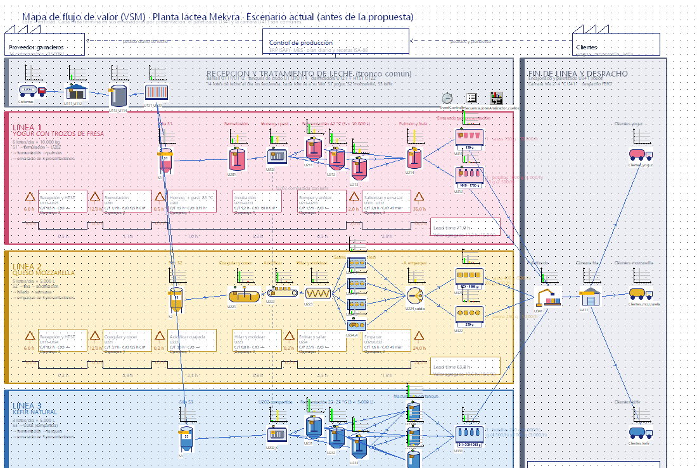
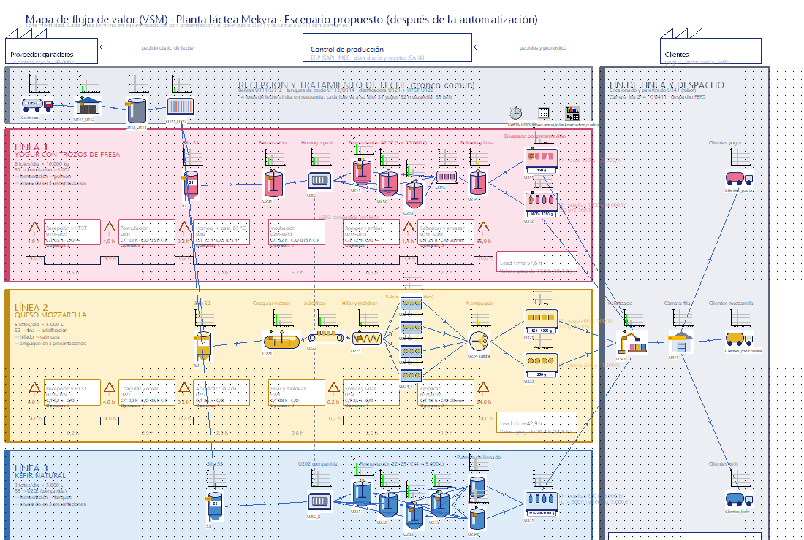
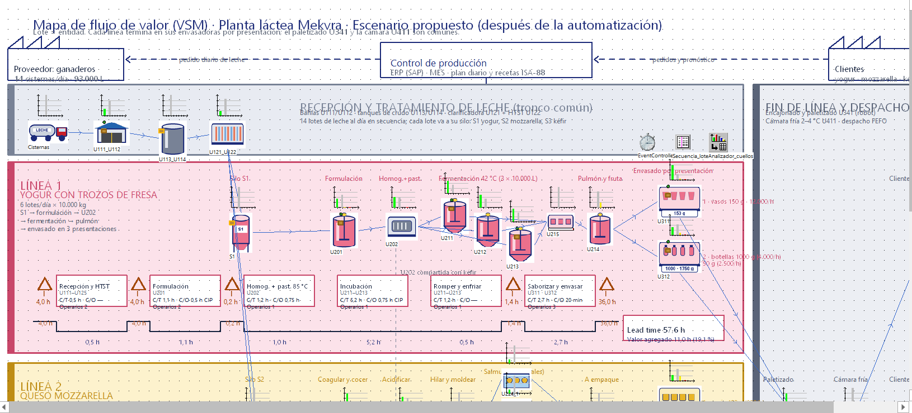

Para regenerarlos: `python dibujar_iconos_vsm.py`, luego `python construir_vsm.py base planta_lactea_vsm_actual.spp` y `python construir_vsm.py prop planta_lactea_vsm_propuesto.spp`.

## Fallas y cuello de botella

Ocho equipos tienen un perfil de falla («Falla», pestaña Failures): disponibilidad y MTTR, contados sobre el tiempo de proceso. Los fermentadores y tanques no tienen fallas, porque su parada es el CIP, que ya está en su tiempo.

| Equipos | Base (MTBF · MTTR) | Propuesta con TPM |
|---|---|---|
| Envasado U311/U312 y empaque U321 | 40 h · 1 h (97,6 %) | 60 h · 45 min (98,8 %) |
| U201, U202, tina, acidificación, hiladora | 80 h · 1,5 h (98,2 %) | 120 h · 1 h (99,2 %) |

Son supuestos de diseño que hay que medir en planta. Al terminar la corrida, el objeto **Analizador_cuellos** (Tools → BottleneckAnalyzer) dibuja sobre cada equipo una gráfica de estados (verde trabajando, amarillo bloqueado, rojo en falla).

Escenario base (30 días): el envasado trabaja 96 %, está 2 % en falla y nunca espera, mientras U201 (61 %), U202 (48 %) y los fermentadores de yogur (31 %) pasan bloqueados esperándolo, así que **el envasado es el cuello de botella**. En kéfir, los fermentadores y tanques están al 95–99 % por la maduración en tanque. Con la propuesta el envasado baja a 72 % y no quedan bloqueos. Quitar el TPM (fallas del escenario base) o partir el MTBF a la mitad baja la capacidad de yogur apenas 1 %: las fallas no son la restricción; el tiempo de envasado sí.

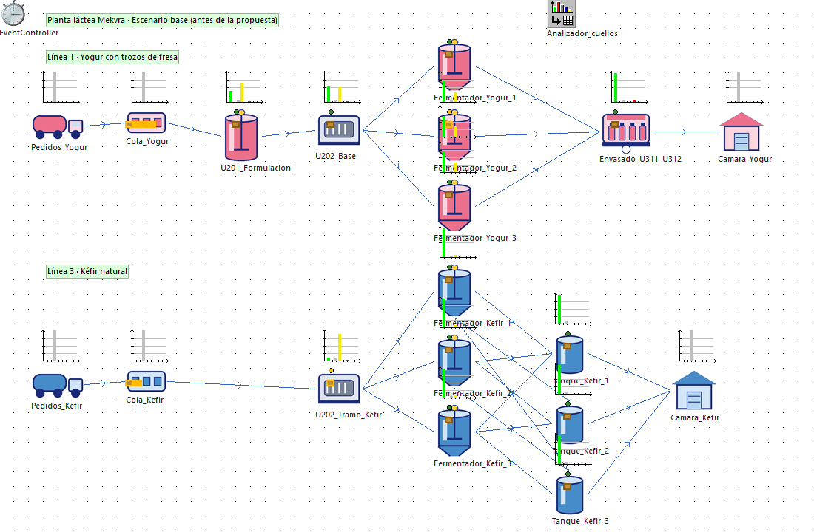
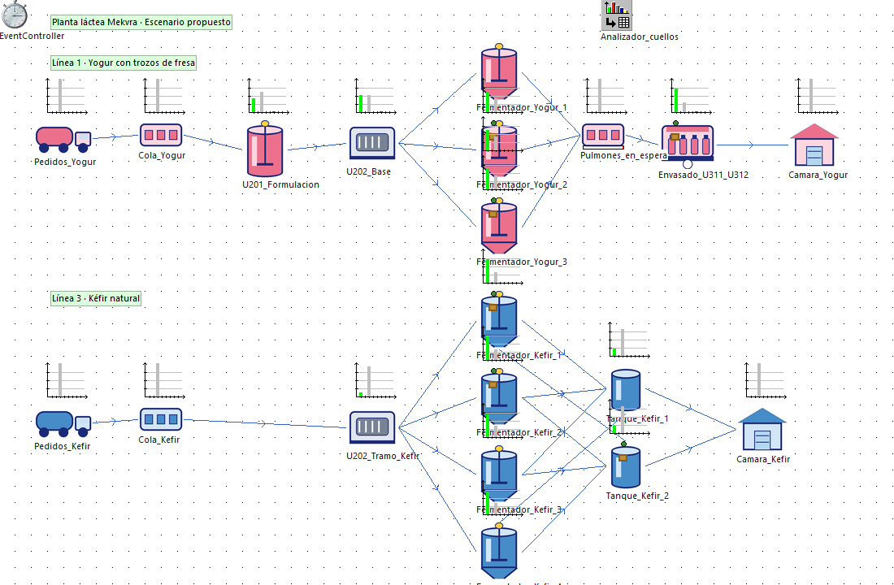

## Cómo regenerarlo

```
python construir_modelo.py base planta_lactea_base.spp 30 demanda
python construir_modelo.py prop planta_lactea_prop.spp 30 demanda
python correr_experimentos.py
python colores_3d.py prop colores_prop.txt
```

`construir_modelo.py` acepta también ajustes y fallas en JSON, por ejemplo `python construir_modelo.py prop - 20 capacidad "{\"y_incub\": 7}" "{\"env\": [30, 0.75]}"`. Después de generar un `.spp`, la escena 3D se crea en la interfaz con Open 2D/3D, y los colores se aplican con la orden de `colores_3d.py`.

Requiere `pywin32` y Plant Simulation 2404 instalado.

## Resultados (30 días)

| Línea | Pedidos | Base: entregados | Propuesta: entregados |
|---|---|---|---|
| Yogur | 180 | 147 (27 en cola) | 177 (0 en cola) |
| Kéfir | 90 | 72 (11 en cola) | 87 (0 en cola) |
| Mozzarella | 150 | 148 | 148 |

Capacidad máxima (lotes/día, 20 días): base yogur 4,85 y kéfir 2,4; propuesta yogur 8,05 y kéfir 4,2. Con la propuesta, el yogur sigue cumpliendo con 8 h de incubación (6,8) o con un solo pulmón (6,85). Deja de cumplir si el vaso YF150 llega al 65 % de la mezcla (5,55). Sin TPM queda en 7,95 y con la mitad del MTBF en 8,0.

## Simplificaciones

- La licencia estudiantil limita el modelo a 80 objetos (el modelo usa 31) y no deja crear métodos SimTalk por COM. Por eso U202, compartida entre yogur y kéfir, se modela como carga dentro de la cadena de yogur.
- La ParallelStation de la versión 2404 libera los lotes de forma sincronizada, así que cada fermentador y cada tanque es una Station propia.
- El CIP se suma al tiempo de ocupación de cada equipo, porque RecoveryTime cuenta desde la entrada del lote.
- Los tiempos de proceso son fijos. Lo único aleatorio son las fallas (una corrida con la semilla por defecto), y cada lote es una entidad.
- Las fallas de la llenadora de kéfir U331 van incluidas en el tiempo de vaciado de los tanques de kéfir.

La escena 3D se crea con el botón Open 2D/3D (gráficos por defecto) y los colores con `_3D.MaterialActive` y `_3D.MaterialDiffuseColor` (`colores_3d.py`).
