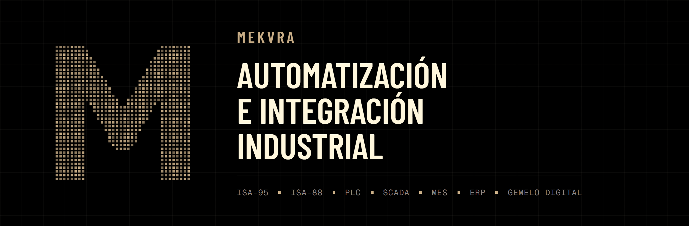
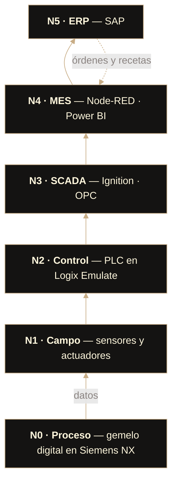

  

  
  
  
  

  <a href="https://mekvra.github.io/proyecto-integrador/"><b>Página web</b></a>
  &nbsp;·&nbsp;
  <a href="#estructura">Estructura</a>
  &nbsp;·&nbsp;
  <a href="#equipo">Equipo</a>
  &nbsp;·&nbsp;
  <a href="CONTRIBUTING.md">Cómo aportar</a>
  &nbsp;·&nbsp;
  Video de sustentación (próximamente)

 

**Mekvra** es una empresa integradora de soluciones de **Transformación Digital Industrial**, formada por ingenieros mecatrónicos. Le proponemos a una planta de derivados lácteos, tomando como referencia los procesos de Alpina en Sopó, una solución que conecta todos sus niveles productivos: del sensor en la tina de cuajado a la decisión en la gerencia.

> Proyecto Integrador del curso **Automatización de Procesos de Manufactura 2026-2S** · Universidad Nacional de Colombia · Sede Bogotá.

## La arquitectura

La información sube desde la planta hasta la gerencia; las órdenes, recetas y decisiones bajan de vuelta. Organizamos la integración con **ISA-95** y la producción por lotes con **ISA-88**.

## Líneas de producción

Tres líneas por lotes que comparten la recepción, la pasteurización y el almacenamiento de la leche.

| Línea | Alcance en el proyecto |
|:--|:--|
| **Queso fresco** | Línea detallada: automatización, celda robotizada, SCADA y gemelo digital |
| **Yogurt** | Caracterización del proceso, recetas ISA-88 y análisis de producción |
| **Kéfir** | Caracterización del proceso, recetas ISA-88 y análisis de producción |

<h2 id="estructura">Estructura</h2>

El repositorio sigue los módulos del curso. Cada carpeta tiene su propio `README.md` con los entregables, el responsable y el estado.

| | Módulo | Contenido |
|:--:|:--|:--|
| `00` | [**Gestión del equipo**](00_gestion-equipo) | Actas, roles y evidencias de trabajo colaborativo |
| `01` | [**Transformación digital**](01_transformacion-digital) | Arquitectura ISA-95, modelos y recetas ISA-88, instrumentación |
| `02` | [**Gestión de la producción**](02_gestion-produccion) | Diagramas de proceso, layout, VSM, OEE, Tecnomatix, MES/ERP |
| `03` | [**Planeación del proyecto**](03_planeacion-proyecto) | EDT, cronograma, presupuesto, flujo de caja, propuesta de valor |
| `04` | [**Controladores**](04_controladores) | Grafcet y lógica Ladder en Logix Emulate |
| `05` | [**Gemelo digital**](05_gemelo-digital) | Línea de quesos en Siemens NX |
| `06` | [**Celda robotizada**](06_celda-robotizada) | Diseño, simulación en RobotStudio y análisis de riesgos |
| `07` | [**SCADA**](07_scada) | HMI ISA-101 en Ignition, comunicación OPC |
| `08` | [**Investigación**](08_investigacion) | Proceso lácteo, variables de operación y fuentes |
| `web` | [**Página web**](web) | Sitio en Astro, publicado automáticamente con GitHub Pages |

<h2 id="equipo">Equipo</h2>

| | Integrante | Rol |
|:--:|:--|:--|
|  | **Luis Alberto Mendoza** [@lmendozar2001](https://github.com/lmendozar2001) | Líder de integración OT/IT |
|  | **Pablo de Jesús Arcila** [@Kreiop](https://github.com/Kreiop) | Líder de arquitectura y modelado técnico |
|  | **David Steven Pinzón Hernández** [@david-pi3141](https://github.com/david-pi3141) | Líder de gestión de producción |
|  | **Daniel Felipe Castro** [@DanielCastro-02](https://github.com/DanielCastro-02) | CFO · Gestión de proyecto |
|  | **Janan Libardo Carreño Riaño** [@JananLC](https://github.com/JananLC) | CTO · Integración digital |

## Cómo aportar

Sube tus archivos a la carpeta de tu módulo, directamente desde GitHub y sin instalar nada. La guía completa, con las reglas de nombres y cómo editar la página web, está en **[CONTRIBUTING.md](CONTRIBUTING.md)**.

 

  
   
  <b>MEKVRA</b> · Automatización e integración industrial

